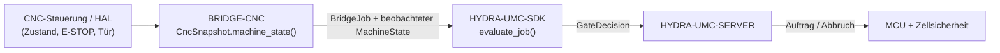

<!-- =============================================================================
HYDRA-UMC-BRIDGE-CNC - CNC-Zellkoordinationsbrücke
Copyright (C) 2026 JuanenRac (Electro Hobby 3D) <electrohobby3d@gmail.com>
GPL-3.0-or-later - see LICENSE
============================================================================= -->

<p align="center">
  
</p>

# 🔧 HYDRA-UMC-BRIDGE-CNC

<p align="center"><a href="README.md">🇺🇸 English</a> | <a href="README_spa.md">🇪🇸 Español</a> | <a href="README_fra.md">🇫🇷 Français</a> | <a href="README_ita.md">🇮🇹 Italiano</a> | 🇩🇪 <b>Deutsch</b> | <a href="README_zho.md">🇨🇳 简体中文</a> | <a href="README_jpn.md">🇯🇵 日本語</a></p>

### 🛑 Ausfallsichere Koordinationsbrücke für CNC-Zellen

<p align="left">
  
  
  
</p>

---

## 1. 🛠️ TECHNISCHER ÜBERBLICK

**HYDRA-UMC-BRIDGE-CNC** ist die High-Level-Brücke zwischen CNC-Zellen und HYDRA-UMC-Roboterhilfsfunktionen: Beladen, Entladen, Werkstückhandhabung und überwachte Hilfsaufgaben. Sie wird niemals zu einem Echtzeit-Bahnsteuerungscontroller — die CNC-Steuerung (LinuxCNC oder andere) behält jederzeit die Autorität über Bahn, Spindel und Maschinengrenzen.

Sie gehört zur Familie **External Automation Bridges**: einer Gruppe von Schwester-Repositories (CNC, LASER, OPENPNP, PRINTER3D, ROS2), die alle denselben gemeinsamen Sicherheitsvertrag von `HYDRA-UMC-SDK` sprechen, sodass keine Brücke ihre eigene Definition von "sicher zum Arbeiten" erfinden kann.

### Kernfunktionen:
* ✅ **Echter ausfallsicherer Zellen-Snapshot:** `cell.py` — `CncSnapshot.machine_state()` prüft E-STOP und Türzustand, *bevor* überhaupt betrachtet wird, was der Controller meldet; ein ausgelöster E-STOP oder eine offene Tür führen immer zu `SAFE_STOP`, unabhängig davon, was `controller_state` sagt. *(implementiert, getestet in `tests/test_cell.py`)*
* ✅ **Echtes gemeinsames Sicherheitsgatter:** jeder beobachtete Auftrag wird über `evaluate_job()` aus dem `bridge_contract` von `HYDRA-UMC-SDK` neu bewertet — demselben Gatter, das jede Schwesterbrücke und HYDRA-UMC-SERVER verwenden. *(implementiert)*
* ✅ **Konservative Zustandsabbildung:** nur `IDLE` wird als Leerlauf behandelt; `RUN`/`RUNNING`/`HOLD` werden auf `RUNNING` abgebildet, `FAULT`/`ERROR`/`OFF` auf `FAULT`, und jeder nicht erkannte Wert fällt auf `OFFLINE` zurück — niemals auf einen Zustand, der produktive Arbeit erlauben würde. *(implementiert)*
* ✅ **Nicht-mutierender Build/Test:** `build-test.bat`/`.sh` kompilieren den Quellcode und führen die Sicherheitsgatter-Testsuite aus, ohne Versionsdateien oder das CHANGELOG anzufassen. *(implementiert, siehe BUILD & AUSFÜHRUNG unten)*
* 🔜 **LinuxCNC-HAL-Adapter** — zurückgestellt; es wurde noch keine reale CNC-Steuerung, kein HAL-Pin und kein Roboter angesteuert. *(geplant)*

---

## 2. 🔄 ZELLKOORDINATIONSABLAUF



---

## 3. 🧱 ARCHITEKTUR UND DESIGN-ENTSCHEIDUNGEN

* **Warum E-STOP und Türzustand vor dem vom Controller selbst gemeldeten Zustand geprüft werden.** `CncSnapshot.machine_state()` springt zuerst auf `SAFE_STOP`, wenn `estop` gesetzt ist oder die Tür nicht geschlossen ist — ein Controller, der weiterhin `IDLE` meldet, während die Tür offen ist, darf niemals wörtlich genommen werden.
* **Warum die Zustandsabbildung des Controllers bewusst konservativ ist.** Nur die wörtliche Zeichenkette `IDLE` wird auf `MachineState.IDLE` abgebildet. Jeder nicht erkannte Wert fällt auf `OFFLINE` zurück, niemals auf etwas, das Hilfsarbeit erlauben würde — ein unbekannter Controller-Zustand wird als "weiß ich nicht" behandelt, nicht als "wahrscheinlich in Ordnung".
* **Warum die Brücke einen neuen `BridgeJob` erstellt und an das gemeinsame `evaluate_job()` delegiert, statt eigene Annahme-/Ablehnungslogik zu schreiben.** Alle fünf External Automation Bridges (CNC, LASER, OPENPNP, PRINTER3D, ROS2) verwenden exakt denselben `bridge_contract` von `HYDRA-UMC-SDK` wieder, sodass "was als sicher für den Start eines Auftrags zählt" zwischen ihnen nicht stillschweigend auseinanderdriften kann.
* **Warum der LinuxCNC-HAL-Adapter noch nicht in diesem Repository ist.** Das Verdrahten echter HAL-Pins ist ein Hardware-/Software-Integrationsschritt, der gegen eine reale Steuerung validiert werden muss; dies hier vor dieser Validierung zu behaupten, wäre eine Behauptung, die dieser lokale Kern nicht belegen kann.
* **Wie das in den Rest des Ökosystems passt.** BRIDGE-CNC sitzt zwischen der CNC-Steuerung und `HYDRA-UMC-SDK` → `HYDRA-UMC-SERVER` → MCU-/Zellsicherheit: es koordiniert Roboter-Hilfsarbeit rund um die CNC, es ersetzt oder überschreibt nicht die eigene Sicherheitsautorität der Steuerung.

---

## 📂 VERZEICHNISSTRUKTUR

```text
HYDRA-UMC-BRIDGE-CNC/
├── src/
│   └── hydra_umc_bridge_cnc/
│       ├── __init__.py
│       └── cell.py              # Sicherheitsgatter CncSnapshot + CncCellBridge
├── tests/
│   └── test_cell.py             # Zulassung im sicheren Leerlauf, Ablehnung bei offener Tür, Abbruchweiterleitung
├── tools/
│   ├── build_test.py            # Nicht-mutierender Compiler + Testläufer (build-test.bat/.sh)
│   └── bump_version.py          # Synchronisiert pyproject.toml, Manifest und CHANGELOG.md
├── build-test.bat / build-test.sh  # Validiert nur, ändert das Repository nie
├── build.bat / build.sh            # Validiert und erhöht bei Erfolg Version + CHANGELOG
├── pyproject.toml               # Paket-Metadaten; hängt von HYDRA-UMC-SDK ab (git)
├── hydra-umc.project.json       # Ökosystem-Manifest (Version, Reifegrad, Familie)
├── CHANGELOG.md
├── CODE_OF_CONDUCT.md / CONTRIBUTING.md / SECURITY.md / SUPPORT.md
├── LICENSE / LICENSE.md
└── README.md / README_*.md      # Diese Datei und ihre 6 Übersetzungen
```

---

## 4. ⚙️ BUILD & AUSFÜHRUNG

Erfordert Python 3.11+. `tools/build_test.py` erwartet, dass `HYDRA-UMC-SDK` als Schwesterverzeichnis (`../HYDRA-UMC-SDK`) ausgecheckt oder über die Umgebungsvariable `HYDRA_UMC_SDK_ROOT` angegeben ist.

```bash
# Windows
build-test.bat      # nur Validierung — keine Versions-/CHANGELOG-Änderung
build.bat            # validiert und erhöht bei Erfolg Version + CHANGELOG

# Linux/macOS
bash build-test.sh
bash build.sh
```

`build-test` kompiliert jedes Modul unter `src/` mit `py_compile` und führt die vollständige `unittest`-Suite aus (`tests/test_cell.py`), was die Zulassung im sicheren Leerlauf, die Ablehnung bei offener Tür und die Abbruchweiterleitung belegt — es ändert das Repository nie. `build` führt zuerst dieselbe Validierung aus und ruft nur bei Erfolg `tools/bump_version.py` auf, um die Version in `pyproject.toml`, `hydra-umc.project.json` und `CHANGELOG.md` zu synchronisieren. Es gibt noch keinen echten CNC-`run`-Befehl — dafür ist eine validierte Controller-Integration erforderlich.

---

## ✅ AKTUELLER STATUS UND NÄCHSTE SCHRITTE

**Heute real:** Version `0.0.2`, ein lokal getesteter ausfallsicherer Zellkoordinator (`CncSnapshot` + `CncCellBridge`), gestützt auf das gemeinsame Auftragsgatter von `HYDRA-UMC-SDK`, eine deterministische `unittest`-Suite sowie nicht-mutierende Build-Test-Skripte, die in CI mit SDK-Checkout eingebunden sind.

**Integrationsgrenze:** die CNC-Steuerung (LinuxCNC oder andere) behält jederzeit die Autorität über Bahn, Spindel und Maschinengrenzen; diese Brücke steuert ausschließlich *Hilfs*-Roboterarbeit, niemals die Bewegung der Steuerung.

**Noch offen:** es wurde noch keine reale CNC-Steuerung, kein LinuxCNC-HAL-Pin und kein Roboter angesteuert — die Auswahl und Validierung eines konkreten HAL-Adapters ist ein Hardware-/Software-Integrationsschritt, der erst nach Verfügbarkeit der Maschine und ihrer dokumentierten Schnittstelle folgt.

---

## 🔗 VERWANDTE PROJEKTE

Dieses Projekt ist Teil eines größeren Robotik-Ökosystems desselben Autors (JuanenRac / Electro Hobby 3D), das Firmware, Steuerungssoftware, KI-Knoten und Flotten-Tooling umfasst. Es lohnt sich, das zu wissen, da eine Anfrage tatsächlich eines dieser Projekte betreffen könnte statt dieses Repositorys.

### Direkt verwandt

- **[HYDRA-UMC-SDK](https://github.com/JuanenRac/HYDRA-UMC-SDK)** — das gemeinsame `bridge_contract`-Auftragsgatter, über das diese Brücke (und alle anderen) ihre Aufträge bewertet.
- **[HYDRA-UMC-SERVER](https://github.com/JuanenRac/HYDRA-UMC-SERVER)** — der authentifizierte Koordinator, an den diese Brücke berichtet.
- **[HYDRA-UMC-HIL-BRIDGE](https://github.com/JuanenRac/HYDRA-UMC-HIL-BRIDGE)** — künftiger Hardware-in-the-Loop-Nachweispfad für die reale Controller-Integration.

### Rest des Ökosystems

**HYDRA-UMC-Plattform** — die Multi-Roboter-Mikrofabrik, für die diese Brücke Hilfsfunktionen koordiniert
- **[HYDRA-UMC](https://github.com/JuanenRac/HYDRA-UMC)** — die CM5- + STM32H745-Hauptplatine, die bis zu 8 Roboterarme orchestriert.
- **[HYDRA-UMC-SERVER](https://github.com/JuanenRac/HYDRA-UMC-SERVER)** — das Express/WebSocket-Backend, mit dem jeder Steuerungsclient und jede Brücke spricht.
- **[HYDRA-UMC-STUDIO](https://github.com/JuanenRac/HYDRA-UMC-STUDIO)** — webbasiertes Steuerungs-Dashboard, Multi-Roboter-3D-Visualisierung.

**External Automation Bridges** — Schwester-Repositories, die dasselbe `HYDRA-UMC-SDK`-Auftragsgatter teilen
- **[HYDRA-UMC-BRIDGE-LASER](https://github.com/JuanenRac/HYDRA-UMC-BRIDGE-LASER)** — Koordinationsbrücke für Laserzellen.
- **[HYDRA-UMC-BRIDGE-OPENPNP](https://github.com/JuanenRac/HYDRA-UMC-BRIDGE-OPENPNP)** — Board-Flow-Brücke für OpenPnP.
- **[HYDRA-UMC-BRIDGE-PRINTER3D](https://github.com/JuanenRac/HYDRA-UMC-BRIDGE-PRINTER3D)** — Koordinationsbrücke für offene 3D-Drucksoftware.
- **[HYDRA-UMC-BRIDGE-ROS2](https://github.com/JuanenRac/HYDRA-UMC-BRIDGE-ROS2)** — bidirektionale Koordinationsgrenze zu ROS 2.

**Sicherheits- und Integrationsnachweise**
- **[HYDRA-UMC-SAFETY-ZONES](https://github.com/JuanenRac/HYDRA-UMC-SAFETY-ZONES)** — Sicherheitsnachweise für Zellzonen, die in der gesamten Brückenfamilie verwendet werden.
- **[HYDRA-UMC-HIL-BRIDGE](https://github.com/JuanenRac/HYDRA-UMC-HIL-BRIDGE)** — Hardware-in-the-Loop-Testnachweise.

## 👤 AUTOR
**JuanenRac** (Electro Hobby 3D)
📧 electrohobby3d@gmail.com

## 📜 LIZENZ
GPL-3.0 - Siehe LICENSE für Details.

## 🛠️ BUILD & AUSFÜHRUNG

Verwenden Sie die versionslose Build-Prüfung vor einem Release-Build:

| Aktion | Windows | Linux / macOS |
|---|---|---|
| Build-Prüfung (keine Versions- oder CHANGELOG-Änderung) | `build-test.bat` | `./build-test.sh` |
| Ausführung / Entwicklung (falls vorhanden) | `run*.bat` oder `dev*.bat` | `./run*.sh` oder `./dev*.sh` |

`build-test.bat` und `build-test.sh` kompilieren oder validieren den Projekt-Stack, ohne `hydra-umc.project.json` zu erhöhen oder `CHANGELOG.md` zu ändern. Sie dürfen nur normale Compiler-Ausgaben erzeugen. Bestehende `build*.bat`-, `build*.sh`-, `run*`- und `dev*`-Skripte behalten ihr projektspezifisches, versioniertes oder Laufzeitverhalten; verwenden Sie sie, wenn dieses Verhalten benötigt wird.
