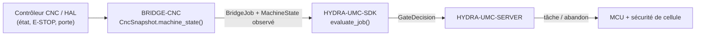

<!-- =============================================================================
HYDRA-UMC-BRIDGE-CNC - Pont de coordination de cellule CNC
Copyright (C) 2026 JuanenRac (Electro Hobby 3D) <electrohobby3d@gmail.com>
GPL-3.0-or-later - see LICENSE
============================================================================= -->

<p align="center">
  
</p>

# 🔧 HYDRA-UMC-BRIDGE-CNC

<p align="center"><a href="README.md">🇺🇸 English</a> | <a href="README_spa.md">🇪🇸 Español</a> | 🇫🇷 <b>Français</b> | <a href="README_ita.md">🇮🇹 Italiano</a> | <a href="README_deu.md">🇩🇪 Deutsch</a> | <a href="README_zho.md">🇨🇳 简体中文</a> | <a href="README_jpn.md">🇯🇵 日本語</a></p>

### 🛑 Pont de coordination à sécurité intrinsèque pour cellules CNC

<p align="left">
  
  
  
</p>

---

## 1. 🛠️ APERÇU TECHNIQUE

**HYDRA-UMC-BRIDGE-CNC** est le pont haut niveau entre les cellules CNC et les auxiliaires robotiques HYDRA-UMC : chargement, déchargement, manipulation de pièces et tâches auxiliaires supervisées. Il ne devient jamais un contrôleur de trajectoire temps réel — le contrôleur CNC (LinuxCNC ou autre) conserve à tout moment l'autorité sur la trajectoire, la broche et les limites machine.

Il appartient à la famille **External Automation Bridges** : un ensemble de dépôts frères (CNC, LASER, OPENPNP, PRINTER3D, ROS2) qui partagent le même contrat de sécurité de `HYDRA-UMC-SDK`, afin qu'aucun pont ne puisse inventer sa propre définition du « sûr pour travailler ».

### Fonctionnalités clés :
* ✅ **Instantané de cellule à sécurité intrinsèque, réel :** `cell.py` — `CncSnapshot.machine_state()` vérifie l'E-STOP et l'état de la porte *avant* de regarder ce que rapporte le contrôleur ; un E-STOP activé ou une porte ouverte résout toujours en `SAFE_STOP`, quel que soit `controller_state`. *(implémenté, testé dans `tests/test_cell.py`)*
* ✅ **Portail de sécurité partagé, réel :** chaque tâche observée est réévaluée via `evaluate_job()` du `bridge_contract` de `HYDRA-UMC-SDK`, le même portail utilisé par tous les ponts frères et HYDRA-UMC-SERVER. *(implémenté)*
* ✅ **Mappage d'état conservateur :** seul `IDLE` est traité comme repos ; `RUN`/`RUNNING`/`HOLD` sont mappés vers `RUNNING`, `FAULT`/`ERROR`/`OFF` vers `FAULT`, et toute valeur non reconnue retombe sur `OFFLINE` — jamais sur un état qui autoriserait un travail productif. *(implémenté)*
* ✅ **Build/test non mutant :** `build-test.bat`/`.sh` compilent le code source et exécutent la suite de tests du portail de sécurité sans toucher aux fichiers de version ni au CHANGELOG. *(implémenté, voir COMPILATION & EXÉCUTION ci-dessous)*
* 🔜 **Adaptateur LinuxCNC HAL** — reporté ; aucun contrôleur CNC réel, broche HAL ou robot n'a encore été piloté. *(prévu)*

---

## 2. 🔄 FLUX DE COORDINATION DE CELLULE



---

## 3. 🧱 ARCHITECTURE ET CHOIX DE CONCEPTION

* **Pourquoi l'E-STOP et l'état de la porte sont vérifiés avant l'état rapporté par le contrôleur lui-même.** `CncSnapshot.machine_state()` court-circuite d'abord vers `SAFE_STOP` sur `estop` ou une porte non fermée — un contrôleur qui rapporte toujours `IDLE` alors que sa porte est ouverte ne doit jamais être pris au pied de la lettre.
* **Pourquoi le mappage de l'état du contrôleur est délibérément conservateur.** Seule la chaîne littérale `IDLE` est mappée vers `MachineState.IDLE`. Toute valeur non reconnue retombe sur `OFFLINE`, jamais sur quelque chose qui permettrait un travail auxiliaire — un état de contrôleur inconnu est traité comme « je ne sais pas », pas comme « probablement correct ».
* **Pourquoi le pont construit un nouveau `BridgeJob` et délègue au `evaluate_job()` partagé plutôt que d'écrire sa propre logique d'acceptation/rejet.** Les cinq External Automation Bridges (CNC, LASER, OPENPNP, PRINTER3D, ROS2) réutilisent exactement le même `bridge_contract` de `HYDRA-UMC-SDK`, afin que « ce qui compte comme sûr pour démarrer une tâche » ne puisse pas diverger silencieusement entre eux.
* **Pourquoi l'adaptateur LinuxCNC HAL n'est pas encore dans ce dépôt.** Câbler de véritables broches HAL est une étape d'intégration matérielle/logicielle qui doit être validée contre un contrôleur réel ; l'affirmer ici avant cette validation serait une affirmation que ce noyau local ne peut pas étayer.
* **Comment cela s'intègre dans le reste de l'écosystème.** BRIDGE-CNC se situe entre le contrôleur CNC et `HYDRA-UMC-SDK` → `HYDRA-UMC-SERVER` → sécurité MCU/cellule : il coordonne le travail robotique auxiliaire autour du CNC, il ne remplace ni n'annule l'autorité de sécurité propre du contrôleur.

---

## 📂 STRUCTURE DES RÉPERTOIRES

```text
HYDRA-UMC-BRIDGE-CNC/
├── src/
│   └── hydra_umc_bridge_cnc/
│       ├── __init__.py
│       └── cell.py              # Portail de sécurité CncSnapshot + CncCellBridge
├── tests/
│   └── test_cell.py             # Admission en repos sûr, rejet porte ouverte, transmission d'abandon
├── tools/
│   ├── build_test.py            # Compilateur + lanceur de tests non mutant (build-test.bat/.sh)
│   └── bump_version.py          # Synchronise pyproject.toml, manifeste et CHANGELOG.md
├── build-test.bat / build-test.sh  # Valide uniquement, ne modifie jamais le dépôt
├── build.bat / build.sh            # Valide puis, si succès, incrémente version + CHANGELOG
├── pyproject.toml               # Métadonnées du paquet ; dépend de HYDRA-UMC-SDK (git)
├── hydra-umc.project.json       # Manifeste de l'écosystème (version, maturité, famille)
├── CHANGELOG.md
├── CODE_OF_CONDUCT.md / CONTRIBUTING.md / SECURITY.md / SUPPORT.md
├── LICENSE / LICENSE.md
└── README.md / README_*.md      # Ce fichier et ses 6 traductions
```

---

## 4. ⚙️ COMPILATION ET EXÉCUTION

Nécessite Python 3.11+. `tools/build_test.py` attend que `HYDRA-UMC-SDK` soit cloné en tant que répertoire frère (`../HYDRA-UMC-SDK`) ou indiqué via la variable d'environnement `HYDRA_UMC_SDK_ROOT`.

```bash
# Windows
build-test.bat      # validation uniquement — pas de changement de version/CHANGELOG
build.bat            # valide puis, si succès, incrémente version + CHANGELOG

# Linux/macOS
bash build-test.sh
bash build.sh
```

`build-test` compile chaque module sous `src/` avec `py_compile` et exécute la suite complète `unittest` (`tests/test_cell.py`), démontrant l'admission en repos sûr, le rejet porte ouverte et la transmission d'abandon — il ne modifie jamais le dépôt. `build` exécute d'abord cette même validation et, seulement en cas de succès, appelle `tools/bump_version.py` pour synchroniser la version dans `pyproject.toml`, `hydra-umc.project.json` et `CHANGELOG.md`. Il n'existe pas encore de commande `run` CNC réelle — cela nécessite une intégration de contrôleur validée.

---

## ✅ ÉTAT ACTUEL ET PROCHAINES ÉTAPES

**Réel aujourd'hui :** version `0.0.2`, un coordinateur de cellule à sécurité intrinsèque testé localement (`CncSnapshot` + `CncCellBridge`) adossé au portail de tâches partagé de `HYDRA-UMC-SDK`, une suite `unittest` déterministe, et des scripts build-test non mutants intégrés en CI avec clonage du SDK.

**Frontière d'intégration :** le contrôleur CNC (LinuxCNC ou autre) conserve à tout moment l'autorité sur la trajectoire, la broche et les limites machine ; ce pont ne fait que réguler le travail robotique *auxiliaire*, jamais le mouvement du contrôleur.

**Encore à venir :** aucun contrôleur CNC réel, broche HAL LinuxCNC ou robot n'a été piloté — choisir et valider un adaptateur HAL concret est une étape d'intégration matérielle/logicielle qui viendra après disposer de la machine et de son interface documentée.

---

## 🔗 PROJETS LIÉS

Ce projet fait partie d'un écosystème robotique plus large du même auteur (JuanenRac / Electro Hobby 3D), couvrant firmware, logiciel de contrôle, nœuds d'IA et outillage de flotte. Cela vaut la peine de le savoir, car une demande pourrait en réalité concerner l'un de ces projets plutôt que ce dépôt.

### Directement liés

- **[HYDRA-UMC-SDK](https://github.com/JuanenRac/HYDRA-UMC-SDK)** — le portail de tâches partagé `bridge_contract` à travers lequel ce pont (et tous les autres) évalue ses tâches.
- **[HYDRA-UMC-SERVER](https://github.com/JuanenRac/HYDRA-UMC-SERVER)** — le coordinateur authentifié auquel ce pont rend compte.
- **[HYDRA-UMC-HIL-BRIDGE](https://github.com/JuanenRac/HYDRA-UMC-HIL-BRIDGE)** — future voie de preuve hardware-in-the-loop pour l'intégration réelle d'un contrôleur.

### Reste de l'écosystème

**Plateforme HYDRA-UMC** — la micro-usine multi-robot pour laquelle ce pont coordonne les auxiliaires
- **[HYDRA-UMC](https://github.com/JuanenRac/HYDRA-UMC)** — la carte mère CM5 + STM32H745 orchestrant jusqu'à 8 bras robotiques.
- **[HYDRA-UMC-SERVER](https://github.com/JuanenRac/HYDRA-UMC-SERVER)** — le backend Express/WebSocket auquel parlent tous les clients de contrôle et ponts.
- **[HYDRA-UMC-STUDIO](https://github.com/JuanenRac/HYDRA-UMC-STUDIO)** — tableau de bord web, visualisation 3D multi-robot.

**External Automation Bridges** — dépôts frères partageant ce même portail de tâches `HYDRA-UMC-SDK`
- **[HYDRA-UMC-BRIDGE-LASER](https://github.com/JuanenRac/HYDRA-UMC-BRIDGE-LASER)** — pont de coordination de cellules laser.
- **[HYDRA-UMC-BRIDGE-OPENPNP](https://github.com/JuanenRac/HYDRA-UMC-BRIDGE-OPENPNP)** — pont de flux de cartes pour OpenPnP.
- **[HYDRA-UMC-BRIDGE-PRINTER3D](https://github.com/JuanenRac/HYDRA-UMC-BRIDGE-PRINTER3D)** — pont de coordination pour logiciels d'impression 3D ouverts.
- **[HYDRA-UMC-BRIDGE-ROS2](https://github.com/JuanenRac/HYDRA-UMC-BRIDGE-ROS2)** — frontière de coordination bidirectionnelle avec ROS 2.

**Preuves de sécurité et d'intégration**
- **[HYDRA-UMC-SAFETY-ZONES](https://github.com/JuanenRac/HYDRA-UMC-SAFETY-ZONES)** — preuves de sécurité des zones de cellule utilisées dans toute la famille de ponts.
- **[HYDRA-UMC-HIL-BRIDGE](https://github.com/JuanenRac/HYDRA-UMC-HIL-BRIDGE)** — preuves de tests hardware-in-the-loop.

## 👤 AUTEUR
**JuanenRac** (Electro Hobby 3D)
📧 electrohobby3d@gmail.com

## 📜 LICENCE
GPL-3.0 - Voir LICENSE pour les détails.

## 🛠️ COMPILATION ET EXÉCUTION

Utilisez la vérification de compilation sans versionnage avant une compilation de publication :

| Action | Windows | Linux / macOS |
|---|---|---|
| Vérification de compilation (sans changement de version ni CHANGELOG) | `build-test.bat` | `./build-test.sh` |
| Exécution / développement (le cas échéant) | `run*.bat` ou `dev*.bat` | `./run*.sh` ou `./dev*.sh` |

`build-test.bat` et `build-test.sh` compilent ou valident la pile du projet sans incrémenter `hydra-umc.project.json` ni modifier `CHANGELOG.md`. Ils ne peuvent produire que la sortie normale du compilateur. Les scripts `build*.bat`, `build*.sh`, `run*` et `dev*` existants conservent leur comportement propre au projet, versionné ou d'exécution ; utilisez-les lorsque ce comportement est requis.
