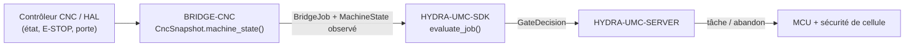

<!-- =============================================================================
HYDRA-UMC-BRIDGE-CNC - Pont de coordination de cellule CNC
Copyright (C) 2026 JuanenRac (Electro Hobby 3D) <electrohobby3d@gmail.com>
GPL-3.0-or-later - see LICENSE
============================================================================= -->

<p align="center">
  
</p>

# 🔧 HYDRA-UMC-BRIDGE-CNC

<p align="center"><a href="README.md">🇺🇸 English</a> | <a href="README_spa.md">🇪🇸 Español</a> | 🇫🇷 <b>Français</b> | <a href="README_ita.md">🇮🇹 Italiano</a> | <a href="README_deu.md">🇩🇪 Deutsch</a> | <a href="README_zho.md">🇨🇳 简体中文</a> | <a href="README_jpn.md">🇯🇵 日本語</a></p>

### 🛑 Pont de coordination à sécurité intrinsèque pour cellules CNC

<p align="left">
  
  
  
</p>

---

## 1. 🛠️ APERÇU TECHNIQUE

**HYDRA-UMC-BRIDGE-CNC** est le pont haut niveau entre les cellules CNC et les auxiliaires robotiques HYDRA-UMC : chargement, déchargement, manipulation de pièces et tâches auxiliaires supervisées. Il ne devient jamais un contrôleur de trajectoire temps réel — le contrôleur CNC (LinuxCNC ou autre) conserve à tout moment l'autorité sur la trajectoire, la broche et les limites machine.

Il appartient à la famille **External Automation Bridges** : un ensemble de dépôts frères (CNC, LASER, OPENPNP, PRINTER3D, ROS2) qui partagent le même contrat de sécurité de `HYDRA-UMC-SDK`, afin qu'aucun pont ne puisse inventer sa propre définition du « sûr pour travailler ».

### Fonctionnalités clés :
* ✅ **Instantané de cellule à sécurité intrinsèque, réel :** `cell.py` — `CncSnapshot.machine_state()` vérifie l'E-STOP et l'état de la porte *avant* de regarder ce que rapporte le contrôleur ; un E-STOP activé ou une porte ouverte résout toujours en `SAFE_STOP`, quel que soit `controller_state`. *(implémenté, testé dans `tests/test_cell.py`)*
* ✅ **Portail de sécurité partagé, réel :** chaque tâche observée est réévaluée via `evaluate_job()` du `bridge_contract` de `HYDRA-UMC-SDK`, le même portail utilisé par tous les ponts frères et HYDRA-UMC-SERVER. *(implémenté)*
* ✅ **Mappage d'état conservateur :** seul `IDLE` est traité comme repos ; `RUN`/`RUNNING`/`HOLD` sont mappés vers `RUNNING`, `FAULT`/`ERROR`/`OFF` vers `FAULT`, et toute valeur non reconnue retombe sur `OFFLINE` — jamais sur un état qui autoriserait un travail productif. *(implémenté)*
* ✅ **Preuve du contrôleur en lecture seule :** `observation.py` normalise strictement la preuve de mappage locale et les lignes d'état GRBL fournies ; les signaux E-STOP/porte omis ou non booléens échouent en mode sécurisé. *(implémenté, testé dans `tests/test_observation.py`)*
* ✅ **Transport série GRBL réel :** `GrblSerialProbe` de `serial_transport.py` ouvre une véritable connexion série et interroge l'octet d'état temps réel de GRBL (`?`) ; `GrblRealtimeControl` n'envoie que les octets de contrôle temps réel propres à GRBL (maintien d'avance, reprise de cycle, réinitialisation douce) — `cycle_start_resume()` est conditionné à une machine véritablement en `HOLDING`, les autres sont toujours autorisés comme `ABORT`. Il ne diffuse jamais un programme G-code. *(implémenté, testé dans `tests/test_serial_transport.py`)*
* ✅ **Build/test non mutant :** `build-test.bat`/`.sh` compilent le code source et exécutent la suite de tests du portail de sécurité sans toucher aux fichiers de version ni au CHANGELOG. *(implémenté, voir COMPILATION & EXÉCUTION ci-dessous)*
* 🔜 **Adaptateur LinuxCNC HAL** — reporté ; aucun contrôleur CNC réel, broche HAL ou robot n'a encore été piloté. *(prévu)*

---

## 2. 🔄 FLUX DE COORDINATION DE CELLULE



---

## 3. 🧱 ARCHITECTURE ET CHOIX DE CONCEPTION

* **Pourquoi l'E-STOP et l'état de la porte sont vérifiés avant l'état rapporté par le contrôleur lui-même.** `CncSnapshot.machine_state()` court-circuite d'abord vers `SAFE_STOP` sur `estop` ou une porte non fermée — un contrôleur qui rapporte toujours `IDLE` alors que sa porte est ouverte ne doit jamais être pris au pied de la lettre.
* **Pourquoi le mappage de l'état du contrôleur est délibérément conservateur.** Seule la chaîne littérale `IDLE` est mappée vers `MachineState.IDLE`. Toute valeur non reconnue retombe sur `OFFLINE`, jamais sur quelque chose qui permettrait un travail auxiliaire — un état de contrôleur inconnu est traité comme « je ne sais pas », pas comme « probablement correct ».
* **Pourquoi le pont construit un nouveau `BridgeJob` et délègue au `evaluate_job()` partagé plutôt que d'écrire sa propre logique d'acceptation/rejet.** Les cinq External Automation Bridges (CNC, LASER, OPENPNP, PRINTER3D, ROS2) réutilisent exactement le même `bridge_contract` de `HYDRA-UMC-SDK`, afin que « ce qui compte comme sûr pour démarrer une tâche » ne puisse pas diverger silencieusement entre eux.
* **Pourquoi l'adaptateur LinuxCNC HAL n'est pas encore dans ce dépôt.** Câbler de véritables broches HAL est une étape d'intégration matérielle/logicielle qui doit être validée contre un contrôleur réel ; l'affirmer ici avant cette validation serait une affirmation que ce noyau local ne peut pas étayer.
* **Comment cela s'intègre dans le reste de l'écosystème.** BRIDGE-CNC se situe entre le contrôleur CNC et `HYDRA-UMC-SDK` → `HYDRA-UMC-SERVER` → sécurité MCU/cellule : il coordonne le travail robotique auxiliaire autour du CNC, il ne remplace ni n'annule l'autorité de sécurité propre du contrôleur.

---

## 📂 STRUCTURE DES RÉPERTOIRES

```text
HYDRA-UMC-BRIDGE-CNC/
├── src/
│   └── hydra_umc_bridge_cnc/
│       ├── __init__.py
│       ├── cell.py              # Portail de sécurité CncSnapshot + CncCellBridge
│       ├── observation.py       # Mappage en lecture seule et normalisation de l'état GRBL
│       ├── serial_transport.py  # Transport série GRBL réel et fail-closed - uniquement requêtes d'état et octets de contrôle temps réel
│       └── mqtt_transport.py    # Transport MQTT réel du broker pour la logique déjà réelle de ce bridge
├── tests/
│   ├── test_cell.py             # Admission en repos sûr, rejet porte ouverte, transmission d'abandon
│   ├── test_observation.py      # Une preuve de sécurité manquante échoue en fail-closed
│   ├── test_serial_transport.py # Transport série réel contre un port simulé, incl. chemins fail-closed
│   └── test_mqtt_transport.py   # Tests de forme commande/état MQTT contre un client broker simulé
├── tools/
│   ├── build_test.py            # Compilateur + lanceur de tests non mutant (build-test.bat/.sh)
│   └── bump_version.py          # Synchronise pyproject.toml, manifeste et CHANGELOG.md
├── docs/
│   ├── BRIDGE_GUIDE.md                    # Portée, plateformes compatibles, scripts, portail d'acceptation matérielle
│   └── CONTROLLER_EVIDENCE_BOUNDARY.md    # Ce qui compte comme preuve de sécurité réelle et ce que ce bridge refuse de déduire
├── images/
│   └── HYDRA_UMC_BANNER.svg     # Bannière du README
├── build-test.bat / build-test.sh  # Valide uniquement, ne modifie jamais le dépôt
├── build.bat / build.sh            # Valide puis, si succès, incrémente version + CHANGELOG
├── pyproject.toml               # Métadonnées du paquet ; dépend de HYDRA-UMC-SDK (git)
├── hydra-umc.project.json       # Manifeste de l'écosystème (version, maturité, famille)
├── CHANGELOG.md
├── CODE_OF_CONDUCT.md / CONTRIBUTING.md / SECURITY.md / SUPPORT.md
├── LICENSE / LICENSE.md
└── README.md / README_*.md      # Ce fichier et ses 6 traductions
```

---

## 4. ⚙️ COMPILATION ET EXÉCUTION

Nécessite Python 3.11+. `tools/build_test.py` attend que `HYDRA-UMC-SDK` soit cloné en tant que répertoire frère (`../HYDRA-UMC-SDK`) ou indiqué via la variable d'environnement `HYDRA_UMC_SDK_ROOT`.

```bash
# Windows
build-test.bat      # validation uniquement — pas de changement de version/CHANGELOG
build.bat            # valide puis, si succès, incrémente version + CHANGELOG

# Linux/macOS
bash build-test.sh
bash build.sh
```

`build-test` compile chaque module sous `src/` avec `py_compile` et exécute la suite complète `unittest` (`tests/test_cell.py`), démontrant l'admission en repos sûr, le rejet porte ouverte et la transmission d'abandon — il ne modifie jamais le dépôt. `build` exécute d'abord cette même validation et, seulement en cas de succès, appelle `tools/bump_version.py` pour synchroniser la version dans `pyproject.toml`, `hydra-umc.project.json` et `CHANGELOG.md`. Il n'existe pas encore de commande `run` CNC réelle — cela nécessite une intégration de contrôleur validée.

---

## ✅ ÉTAT ACTUEL ET PROCHAINES ÉTAPES

**Réel aujourd'hui :** version `0.0.7`, un coordinateur de cellule à sécurité intrinsèque testé localement (`CncSnapshot` + `CncCellBridge`) adossé au portail de tâches partagé de `HYDRA-UMC-SDK`, une normalisation stricte et en lecture seule de l'évidence contrôleur couvrant tout le vocabulaire d'état réel de GRBL v1.1, y compris les vrais sous-états `Hold:N`/`Door:N` (`Idle`/`Run`/`Jog`/`Home`/`Hold`/`Alarm`/`Door`) ainsi que les états d'exécution MTConnect, un transport série réel (`GrblSerialProbe`/`GrblRealtimeControl`) capable d'interroger l'état et d'envoyer les octets de contrôle temps réel propres à GRBL sur une véritable connexion, une suite `unittest` déterministe de quarante-deux tests, et des scripts build-test non mutants intégrés en CI avec clonage du SDK.

**Frontière d'intégration :** le contrôleur CNC (LinuxCNC ou autre) conserve à tout moment l'autorité sur la trajectoire, la broche et les limites machine ; ce pont ne fait que réguler le travail robotique *auxiliaire*, jamais le mouvement du contrôleur.

**Encore à venir :** aucun contrôleur CNC réel, broche HAL LinuxCNC ou robot n'a été piloté — choisir et valider un adaptateur HAL concret est une étape d'intégration matérielle/logicielle qui viendra après disposer de la machine et de son interface documentée.

---

## 🔗 Projets Liés

Ce projet fait partie de l'écosystème robotique HYDRA-UMC du même auteur (JuanenRac / Electro Hobby 3D). Bon à savoir, car une demande pourrait en réalité concerner l'un de ceux-ci plutôt que ce dépôt.

**Projet Parent**
- **[HYDRA-UMC-SERVER](https://github.com/JuanenRac/HYDRA-UMC-SERVER)** — le vrai backend headless (REST/WebSocket) auquel parle réellement chaque client de contrôle ; la frontière authentifiée de l'écosystème à laquelle ce bridge rend compte une fois chaque commande passée par la propre barrière de sécurité locale de ce bridge.

**Projets Frères** — parlent également à la propre API de HYDRA-UMC-SERVER, chacun en tant que son propre client
- **[HYDRA-UMC-STUDIO](https://github.com/JuanenRac/HYDRA-UMC-STUDIO)** — tableau de bord de contrôle web avec visualisation 3D multi-robot en temps réel.
- **[HYDRA-UMC-SUITE](https://github.com/JuanenRac/HYDRA-UMC-SUITE)** — centre de commande d'essaim de bureau (PySide6) pour plusieurs serveurs à la fois, empaqueté en exécutable autonome.
- **[HYDRA-UMC-ANDROID-CONTROL](https://github.com/JuanenRac/HYDRA-UMC-ANDROID-CONTROL)** — application de contrôle Android native avec connexion biométrique et un compagnon Wear OS jumelé.
- **[HYDRA-UMC-IOS-CONTROL](https://github.com/JuanenRac/HYDRA-UMC-IOS-CONTROL)** — application de contrôle iOS/iPadOS (Flutter) avec synchronisation WebSocket en temps réel.
- **[HYDRA-UMC-DSI](https://github.com/JuanenRac/HYDRA-UMC-DSI)** — interface tactile native pour l'écran tactile DSI 7" embarqué, intégrée directement sur le CM5.
- **[HYDRA-UMC-BRIDGE-AMR](https://github.com/JuanenRac/HYDRA-UMC-BRIDGE-AMR)** — frontière de coordination pour les flottes AGV/AMR via un éditeur MQTT VDA 5050 réel.
- **[HYDRA-UMC-BRIDGE-DROIDS](https://github.com/JuanenRac/HYDRA-UMC-BRIDGE-DROIDS)** — frontière de coordination pour droïdes à pattes/humanoïdes, avec un véritable émetteur de commandes Boston Dynamics Spot.
- **[HYDRA-UMC-BRIDGE-LASER](https://github.com/JuanenRac/HYDRA-UMC-BRIDGE-LASER)** — coordinateur de sécurité pour cellules laser lisant 3 vraies sécurités GPIO de clé/enceinte/verrouillage.
- **[HYDRA-UMC-BRIDGE-OPENPNP](https://github.com/JuanenRac/HYDRA-UMC-BRIDGE-OPENPNP)** — coordinateur haut niveau sûr pour le flux de cartes du pick-and-place OpenPnP.
- **[HYDRA-UMC-BRIDGE-PRINTER3D](https://github.com/JuanenRac/HYDRA-UMC-BRIDGE-PRINTER3D)** — frontière de coordination sûre pour imprimantes 3D Moonraker/Klipper, avec de vraies commandes de tâche contrôlées.
- **[HYDRA-UMC-BRIDGE-ROS2](https://github.com/JuanenRac/HYDRA-UMC-BRIDGE-ROS2)** — coordinateur de sécurité avec un vrai transport ROS 2 rclpy à importation paresseuse.
- **[HYDRA-UMC-BRIDGE-UAV](https://github.com/JuanenRac/HYDRA-UMC-BRIDGE-UAV)** — frontière de coordination pour UAV équipés de caméra, avec un véritable émetteur de commandes MAVLink.

**Directement Liés**
- **[HYDRA-UMC-SDK](https://github.com/JuanenRac/HYDRA-UMC-SDK)** — le contrat JSON-Schema partagé et la barrière de sécurité contre laquelle chaque bridge valide ses commandes.
- **[HYDRA-UMC-MQTT-BROKER](https://github.com/JuanenRac/HYDRA-UMC-MQTT-BROKER)** — le vrai transport de `mqtt_transport.py` pour les propres topics `hydra/bridges/cnc/...` de ce bridge — statut plus les octets de contrôle jog/reset/resume, avec la barrière de tâches partagée ; voir le propre `docs/BRIDGE_TOPICS.md` de ce dépôt.
- **[HYDRA-UMC-HIL-BRIDGE](https://github.com/JuanenRac/HYDRA-UMC-HIL-BRIDGE)** — futur chemin de preuve hardware-in-the-loop pour l'intégration réelle du contrôleur.

**Fait Également Partie de l'Écosystème**

*Matériel & Plateforme de Base*
- **[HYDRA-UMC](https://github.com/JuanenRac/HYDRA-UMC)** — la carte mère physique du bras robotique : hôte CM5 + coprocesseur STM32H745 double cœur, coordonnant jusqu'à 8 bras-outils via CAN-OTA/SPI-OTA.
- **[HYDRA-UMC-OS](https://github.com/JuanenRac/HYDRA-UMC-OS)** — couche produit reproductible sur Raspberry Pi OS pour le CM5 : agent en lecture seule, config/profils validés, provisionnement WiFi de premier contact.

*Backend Central & Clients*
- **[HYDRA-UMC-EDITOR-URDF](https://github.com/JuanenRac/HYDRA-UMC-EDITOR-URDF)** — créateur/éditeur graphique de bureau pour URDF qui envoie les modèles terminés vers le propre catalogue de STUDIO.

*Plateforme d'Outils URTC*
- **[URTC](https://github.com/JuanenRac/URTC)** — firmware pour la carte physique Universal Robot Tool Controller, plus de 25 profils d'outil sur bus CAN.
- **[URTC-FLASHER](https://github.com/JuanenRac/URTC-FLASHER)** — outil de bureau à interface graphique pour flasher les cartes URTC, CAN-OTA plus SWD/JTAG puce complète.
- **[URTC-TESTER](https://github.com/JuanenRac/URTC-TESTER)** — outil de bureau de diagnostic CAN-bus en direct pour cartes URTC, un panneau par profil d'outil.
- **[URTC-WEB-STUDIO](https://github.com/JuanenRac/URTC-WEB-STUDIO)** — alternative basée navigateur à URTC-TESTER via la Web Serial API, sans installation locale.

*Nœud IA de Vision (Hailo-8)*
- **[HYDRA-UMC-VISION-NODE](https://github.com/JuanenRac/HYDRA-UMC-VISION-NODE)** — hub d'intégration pour le pipeline de vision Hailo-8, avec une vraie vérification de disponibilité matérielle par étape.
- **[HYDRA-UMC-DETECTION-HEF](https://github.com/JuanenRac/HYDRA-UMC-DETECTION-HEF)** — registre réel de modèles compilés avec vérification de chargement sécurisé par architecture Hailo/checksum.
- **[HYDRA-UMC-VISION-STREAMER](https://github.com/JuanenRac/HYDRA-UMC-VISION-STREAMER)** — générateur réel de pipeline GStreamer + config MediaMTX, avec une vraie frontière d'intégration HailoRT.
- **[HYDRA-UMC-VISUAL-SERVOING-API](https://github.com/JuanenRac/HYDRA-UMC-VISUAL-SERVOING-API)** — vraie loi de correction Position-Based Visual Servoing, verrouillée sur l'état de zone en amont.
- **[HYDRA-UMC-SAFETY-ZONES](https://github.com/JuanenRac/HYDRA-UMC-SAFETY-ZONES)** — vraie vérification de violation de zone et demande d'E-STOP, avec application de la fraîcheur de calibration.

*Nœud IA Cognitif (Hailo-10)*
- **[HYDRA-UMC-COGNITIVE-NODE](https://github.com/JuanenRac/HYDRA-UMC-COGNITIVE-NODE)** — hub d'intégration pour le pipeline cognitif Hailo-10 (orchestration LLM/VLA/voix).
- **[HYDRA-UMC-VLA-ENGINE](https://github.com/JuanenRac/HYDRA-UMC-VLA-ENGINE)** — vrai encodage/décodage de jetons d'action et génération de trajectoire pour un modèle Vision-Language-Action.
- **[HYDRA-UMC-VOICE-UI](https://github.com/JuanenRac/HYDRA-UMC-VOICE-UI)** — vrai front-end vocal (VAD + analyseur d'intention) avec un relais Watch borné et soumis à confirmation.
- **[HYDRA-UMC-SEMANTIC-PLANNER](https://github.com/JuanenRac/HYDRA-UMC-SEMANTIC-PLANNER)** — vraie décomposition de tâches basée sur des règles et récupération sémantique d'erreurs sur les codes d'erreur MCU.
- **[HYDRA-UMC-DOCS-QA](https://github.com/JuanenRac/HYDRA-UMC-DOCS-QA)** — vraie recherche documentaire TF-IDF (bibliothèque standard uniquement) sur les propres documents Markdown de cet écosystème.

*Orchestration & Essaim*
- **[HYDRA-UMC-ORCHESTRATOR](https://github.com/JuanenRac/HYDRA-UMC-ORCHESTRATOR)** — hub d'intégration avec un vrai contrat de rapport de santé gRPC/Protobuf et une machine à états de mission.
- **[HYDRA-UMC-JOB-DISPATCHER](https://github.com/JuanenRac/HYDRA-UMC-JOB-DISPATCHER)** — vraie file de tâches basée sur la priorité avec déduplication, via une vraie API HTTP.
- **[HYDRA-UMC-NODE-HEALING](https://github.com/JuanenRac/HYDRA-UMC-NODE-HEALING)** — vrai chien de garde de santé de flotte basé sur gRPC, avec retry/backoff et détection d'incohérence d'identité.
- **[HYDRA-UMC-PATH-PLANNER-3D](https://github.com/JuanenRac/HYDRA-UMC-PATH-PLANNER-3D)** — vrai planificateur de trajectoire 3D basé sur RRT, avec vraie validation des collisions obstacle/espace de travail.
- **[HYDRA-UMC-SWARM-SYNC](https://github.com/JuanenRac/HYDRA-UMC-SWARM-SYNC)** — vraie synchronisation d'état CRDT LWW-Element-Map, testée par propriétés pour la convergence multi-cellule.

*Jumeau Numérique & Simulation*
- **[HYDRA-UMC-TWIN](https://github.com/JuanenRac/HYDRA-UMC-TWIN)** — hub d'intégration pour le moteur de jumeau numérique, avec un vrai contrat de synchronisation par compatibilité de version.
- **[HYDRA-UMC-PHYSICS-REPLICA](https://github.com/JuanenRac/HYDRA-UMC-PHYSICS-REPLICA)** — vraie cinématique directe et validation des limites articulaires sur un vrai sous-ensemble URDF.
- **[HYDRA-UMC-SYNTHETIC-DATA-GEN](https://github.com/JuanenRac/HYDRA-UMC-SYNTHETIC-DATA-GEN)** — vrai générateur procédural de scènes 2D avec export d'annotations YOLO/COCO.

*Données & Analytique*
- **[HYDRA-UMC-DATALAKE](https://github.com/JuanenRac/HYDRA-UMC-DATALAKE)** — vrai magasin de séries temporelles basé sur sqlite3, avec une vraie API HTTP d'ingestion/requête.
- **[HYDRA-UMC-ANOMALY-DETECTOR](https://github.com/JuanenRac/HYDRA-UMC-ANOMALY-DETECTOR)** — vrai détecteur d'anomalies FFT + ligne de base statistique, avec surveillance de dérive.
- **[HYDRA-UMC-PRODUCTION-REPORTS](https://github.com/JuanenRac/HYDRA-UMC-PRODUCTION-REPORTS)** — vrai calcul OEE/disponibilité sur l'historique de DATALAKE, avec export CSV reproductible.
- **[HYDRA-UMC-TELEMETRY-COLLECTOR](https://github.com/JuanenRac/HYDRA-UMC-TELEMETRY-COLLECTOR)** — vrai pipeline d'ingestion CAN/WebSocket vers DATALAKE, avec déduplication par séquence.

*Passerelle Industrielle*
- **[HYDRA-UMC-GATEWAY-INDUSTRIAL](https://github.com/JuanenRac/HYDRA-UMC-GATEWAY-INDUSTRIAL)** — hub d'intégration relayant vers les protocoles industriels, avec une vraie couche de liste blanche de commandes/contre-pression.
- **[HYDRA-UMC-OPCUA-SERVER](https://github.com/JuanenRac/HYDRA-UMC-OPCUA-SERVER)** — vrai espace d'adressage OPC-UA, vérifié avec une vraie session client du protocole binaire.
- **[HYDRA-UMC-MTCONNECT-ADAPTER](https://github.com/JuanenRac/HYDRA-UMC-MTCONNECT-ADAPTER)** — vrais points de terminaison XML MTConnect `/probe` et `/current`, avec sortie en mode dégradé.

*Outils Complémentaires & Opérations de l'Écosystème*
- **[HYDRA-UMC-DASHBOARD-AI](https://github.com/JuanenRac/HYDRA-UMC-DASHBOARD-AI)** — panneaux Smart Summaries et Anomaly Highlighting sur DATALAKE/ANOMALY-DETECTOR, avec un repli statistique honnête.
- **[HYDRA-UMC-TOOL-CLI](https://github.com/JuanenRac/HYDRA-UMC-TOOL-CLI)** — CLI de flotte avec un vrai contrat de codes de sortie stable, un vrai client en direct de la propre API de HYDRA-UMC-SERVER.
- **[HYDRA-UMC-WATCH](https://github.com/JuanenRac/HYDRA-UMC-WATCH)** — application compagnon WearOS avec de vraies alertes haptiques et un relais vocal vers le téléphone jumelé.
- **[URTC-SMART-RACK](https://github.com/JuanenRac/URTC-SMART-RACK)** — firmware pour un rack de montage de cartes avec décodage réel d'ID d'outil et logique de préchauffage Smart Idle.
- **[URTC-VISION-TOOL](https://github.com/JuanenRac/URTC-VISION-TOOL)** — firmware plus un vrai compagnon de vision Python pour une tête d'outil d'inspection thermique/RGB.
- **[HYDRA-UMC-UPDATER](https://github.com/JuanenRac/HYDRA-UMC-UPDATER)** — outil administratif de bureau qui découvre, clone et met à jour chaque dépôt de cet écosystème.
- **[HYDRA-UMC-OS-REBUILDER](https://github.com/JuanenRac/HYDRA-UMC-OS-REBUILDER)** — outil de bureau Windows/Linux qui construit une image de la CM5 prête à graver, préchargée avec les versions les plus actuelles de l'écosystème, avec une configuration de premier démarrage Wi-Fi/utilisateur/SSH façon Raspberry Pi Imager.

---

## 📚 Documentation & Communauté

- **[CONTRIBUTING.md](CONTRIBUTING.md)** — pile technologique et lignes directrices de codage pour une pull request.
- **[CODE_OF_CONDUCT.md](CODE_OF_CONDUCT.md)** — les normes de comportement attendues dans cette communauté.
- **[SECURITY.md](SECURITY.md)** — comment signaler une vulnérabilité, et les véritables axes de sécurité de ce projet.
- **[SUPPORT.md](SUPPORT.md)** — où poser des questions et signaler des bugs.
- **[LICENSE.md](LICENSE.md)** — la licence propre de ce projet.

## 👤 AUTEUR
**JuanenRac** (Electro Hobby 3D)
📧 electrohobby3d@gmail.com
📺 [youtube.com/@electrohobby3d](https://youtube.com/@electrohobby3d)

## 📜 LICENCE
GPL-3.0 - Voir LICENSE pour les détails.
