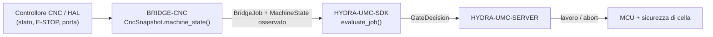

<!-- =============================================================================
HYDRA-UMC-BRIDGE-CNC - Ponte di coordinamento cella CNC
Copyright (C) 2026 JuanenRac (Electro Hobby 3D) <electrohobby3d@gmail.com>
GPL-3.0-or-later - see LICENSE
============================================================================= -->

<p align="center">
  
</p>

# 🔧 HYDRA-UMC-BRIDGE-CNC

<p align="center"><a href="README.md">🇺🇸 English</a> | <a href="README_spa.md">🇪🇸 Español</a> | <a href="README_fra.md">🇫🇷 Français</a> | 🇮🇹 <b>Italiano</b> | <a href="README_deu.md">🇩🇪 Deutsch</a> | <a href="README_zho.md">🇨🇳 简体中文</a> | <a href="README_jpn.md">🇯🇵 日本語</a></p>

### 🛑 Ponte di coordinamento fail-safe per celle CNC

<p align="left">
  
  
  
</p>

---

## 1. 🛠️ PANORAMICA TECNICA

**HYDRA-UMC-BRIDGE-CNC** è il ponte di alto livello tra celle CNC e ausiliari robotici HYDRA-UMC: carico, scarico, movimentazione pezzi e attività ausiliarie supervisionate. Non diventa mai un controllore di traiettoria in tempo reale — il controllore CNC (LinuxCNC o altro) mantiene sempre l'autorità su traiettoria, mandrino e limiti macchina.

Appartiene alla famiglia **External Automation Bridges**: un insieme di repository fratelli (CNC, LASER, OPENPNP, PRINTER3D, ROS2) che condividono lo stesso contratto di sicurezza di `HYDRA-UMC-SDK`, così nessun ponte può inventare una propria definizione di "sicuro per lavorare".

### Caratteristiche principali:
* ✅ **Snapshot di cella fail-safe, reale:** `cell.py` — `CncSnapshot.machine_state()` controlla l'E-STOP e lo stato della porta *prima* di guardare ciò che riporta il controllore; un E-STOP attivo o una porta aperta risolvono sempre in `SAFE_STOP`, indipendentemente da ciò che dice `controller_state`. *(implementato, testato in `tests/test_cell.py`)*
* ✅ **Porta di sicurezza condivisa, reale:** ogni lavoro osservato viene rivalutato tramite `evaluate_job()` del `bridge_contract` di `HYDRA-UMC-SDK`, la stessa porta usata da tutti i ponti fratelli e da HYDRA-UMC-SERVER. *(implementato)*
* ✅ **Mappatura di stato conservativa:** solo `IDLE` è trattato come riposo; `RUN`/`RUNNING`/`HOLD` vengono mappati su `RUNNING`, `FAULT`/`ERROR`/`OFF` su `FAULT`, e qualsiasi valore non riconosciuto ricade su `OFFLINE` — mai su uno stato che permetterebbe lavoro produttivo. *(implementato)*
* ✅ **Build/test non mutante:** `build-test.bat`/`.sh` compilano il codice sorgente ed eseguono la suite di test della porta di sicurezza senza toccare i file di versione o il CHANGELOG. *(implementato, vedi COMPILAZIONE ED ESECUZIONE più snove)*
* 🔜 **Adattatore LinuxCNC HAL** — rimandato; nessun controllore CNC reale, pin HAL o robot è stato ancora azionato. *(pianificato)*

---

## 2. 🔄 FLUSSO DI COORDINAMENTO DELLA CELLA



---

## 3. 🧱 ARCHITETTURA E DECISIONI DI PROGETTAZIONE

* **Perché l'E-STOP e lo stato della porta vengono controllati prima dello stato riportato dal controllore stesso.** `CncSnapshot.machine_state()` va direttamente in cortocircuito su `SAFE_STOP` in caso di `estop` o porta non chiusa, prima di ogni altra cosa — un controllore che continua a riportare `IDLE` con la porta aperta non deve mai essere preso alla lettera.
* **Perché la mappatura dello stato del controllore è deliberatamente conservativa.** Solo la stringa letterale `IDLE` viene mappata su `MachineState.IDLE`. Qualsiasi valore non riconosciuto ricade su `OFFLINE`, mai su qualcosa che permetterebbe lavoro ausiliario — uno stato del controllore sconosciuto viene trattato come "non lo so", non come "probabilmente va bene".
* **Perché il ponte costruisce un nuovo `BridgeJob` e delega al `evaluate_job()` condiviso invece di scrivere una propria logica di accettazione/rifiuto.** Tutti e cinque gli External Automation Bridges (CNC, LASER, OPENPNP, PRINTER3D, ROS2) riutilizzano esattamente lo stesso `bridge_contract` di `HYDRA-UMC-SDK`, così "cosa conta come sicuro per avviare un lavoro" non può divergere silenziosamente tra loro.
* **Perché l'adattatore LinuxCNC HAL non è ancora in questo repository.** Cablare pin HAL reali è un passo di integrazione hardware/software che deve essere validato contro un controllore reale; affermarlo qui prima di quella validazione sarebbe un'affermazione che questo nucleo locale non può sostenere.
* **Come si inserisce nel resto dell'ecosistema.** BRIDGE-CNC si trova tra il controllore CNC e `HYDRA-UMC-SDK` → `HYDRA-UMC-SERVER` → sicurezza MCU/cella: coordina il lavoro robotico ausiliario attorno al CNC, non sostituisce né annulla l'autorità di sicurezza propria del controllore.

---

## 📂 STRUTTURA DELLE DIRECTORY

```text
HYDRA-UMC-BRIDGE-CNC/
├── src/
│   └── hydra_umc_bridge_cnc/
│       ├── __init__.py
│       └── cell.py              # Porta di sicurezza CncSnapshot + CncCellBridge
├── tests/
│   └── test_cell.py             # Ammissione in riposo sicuro, rifiuto porta aperta, inoltro abort
├── tools/
│   ├── build_test.py            # Compilatore + esecutore di test non mutante (build-test.bat/.sh)
│   └── bump_version.py          # Sincronizza pyproject.toml, manifesto e CHANGELOG.md
├── build-test.bat / build-test.sh  # Solo valida, non modifica mai il repository
├── build.bat / build.sh            # Valida e, solo in caso di successo, aggiorna versione + CHANGELOG
├── pyproject.toml               # Metadati del pacchetto; dipende da HYDRA-UMC-SDK (git)
├── hydra-umc.project.json       # Manifesto dell'ecosistema (versione, maturità, famiglia)
├── CHANGELOG.md
├── CODE_OF_CONDUCT.md / CONTRIBUTING.md / SECURITY.md / SUPPORT.md
├── LICENSE / LICENSE.md
└── README.md / README_*.md      # Questo file e le sue 6 traduzioni
```

---

## 4. ⚙️ COMPILAZIONE ED ESECUZIONE

Richiede Python 3.11+. `tools/build_test.py` si aspetta che `HYDRA-UMC-SDK` sia clonato come directory fratella (`../HYDRA-UMC-SDK`) o indicato tramite la variabile d'ambiente `HYDRA_UMC_SDK_ROOT`.

```bash
# Windows
build-test.bat      # solo validazione — nessun cambio di versione/CHANGELOG
build.bat            # valida e, se ha successo, aggiorna versione + CHANGELOG

# Linux/macOS
bash build-test.sh
bash build.sh
```

`build-test` compila ogni modulo snove `src/` con `py_compile` ed esegue l'intera suite `unittest` (`tests/test_cell.py`), dimostrando l'ammissione in riposo sicuro, il rifiuto porta aperta e l'inoltro dell'abort — non modifica mai il repository. `build` esegue prima quella stessa validazione e, solo in caso di successo, chiama `tools/bump_version.py` per sincronizzare la versione in `pyproject.toml`, `hydra-umc.project.json` e `CHANGELOG.md`. Non esiste ancora un comando `run` CNC reale — serve un'integrazione del controllore validata.

---

## ✅ STATO ATTUALE E PROSSIMI PASSI

**Reale oggi:** versione `0.0.4`, un coordinatore di cella fail-safe testato in locale (`CncSnapshot` + `CncCellBridge`) appoggiato sulla porta di lavoro condivisa di `HYDRA-UMC-SDK`, normalizzazione rigorosa e in sola lettura dell'evidenza del controllore, una suite `unittest` deterministica di nove test, e script build-test non mutanti collegati alla CI con checkout dell'SDK.

**Confine di integrazione:** il controllore CNC (LinuxCNC o altro) mantiene sempre l'autorità su traiettoria, mandrino e limiti macchina; questo ponte regola solo il lavoro robotico *ausiliario*, mai il movimento del controllore.

**Ancora da fare:** nessun controllore CNC reale, pin HAL LinuxCNC o robot è stato azionato — scegliere e validare un adattatore HAL concreto è un passo di integrazione hardware/software successivo alla disponibilità della macchina e della sua interfaccia documentata.

---

## 🔗 PROGETTI CORRELATI

Questo progetto fa parte di un ecosistema robotico più ampio dello stesso autore (JuanenRac / Electro Hobby 3D), che copre firmware, software di controllo, nodi IA e strumenti di flotta. Vale la pena saperlo, perché una richiesta potrebbe in realtà riguardare uno di questi progetti anziché questo repository.

### Direttamente correlati

- **[HYDRA-UMC-SDK](https://github.com/JuanenRac/HYDRA-UMC-SDK)** — la porta di lavoro condivisa `bridge_contract` attraverso cui questo ponte (e tutti gli altri) valuta i propri lavori.
- **[HYDRA-UMC-SERVER](https://github.com/JuanenRac/HYDRA-UMC-SERVER)** — il coordinatore autenticato a cui questo ponte riporta.
- **[HYDRA-UMC-HIL-BRIDGE](https://github.com/JuanenRac/HYDRA-UMC-HIL-BRIDGE)** — futura via di evidenza hardware-in-the-loop per l'integrazione reale con un controllore.

### Resto dell'ecosistema

**Piattaforma HYDRA-UMC** — la micro-fabbrica multi-robot per cui questo ponte coordina gli ausiliari
- **[HYDRA-UMC](https://github.com/JuanenRac/HYDRA-UMC)** — la scheda madre CM5 + STM32H745 che orchestra fino a 8 bracci robotici.
- **[HYDRA-UMC-SERVER](https://github.com/JuanenRac/HYDRA-UMC-SERVER)** — il backend Express/WebSocket con cui parlano tutti i client di controllo e i ponti.
- **[HYDRA-UMC-STUDIO](https://github.com/JuanenRac/HYDRA-UMC-STUDIO)** — dashboard di controllo web, visualizzazione 3D multi-robot.

**External Automation Bridges** — repository fratelli che condividono questa stessa porta di lavoro `HYDRA-UMC-SDK`
- **[HYDRA-UMC-BRIDGE-LASER](https://github.com/JuanenRac/HYDRA-UMC-BRIDGE-LASER)** — ponte di coordinamento celle laser.
- **[HYDRA-UMC-BRIDGE-OPENPNP](https://github.com/JuanenRac/HYDRA-UMC-BRIDGE-OPENPNP)** — ponte di flusso schede per OpenPnP.
- **[HYDRA-UMC-BRIDGE-PRINTER3D](https://github.com/JuanenRac/HYDRA-UMC-BRIDGE-PRINTER3D)** — ponte di coordinamento per software di stampa 3D open.
- **[HYDRA-UMC-BRIDGE-ROS2](https://github.com/JuanenRac/HYDRA-UMC-BRIDGE-ROS2)** — confine di coordinamento bidirezionale con ROS 2.

**Evidenze di sicurezza e integrazione**
- **[HYDRA-UMC-SAFETY-ZONES](https://github.com/JuanenRac/HYDRA-UMC-SAFETY-ZONES)** — evidenze di sicurezza delle zone di cella usate in tutta la famiglia di ponti.
- **[HYDRA-UMC-HIL-BRIDGE](https://github.com/JuanenRac/HYDRA-UMC-HIL-BRIDGE)** — evidenze di test hardware-in-the-loop.

## 👤 AUTORE
**JuanenRac** (Electro Hobby 3D)
📧 electrohobby3d@gmail.com

## 📜 LICENZA
GPL-3.0 - Vedi LICENSE per i dettagli.
