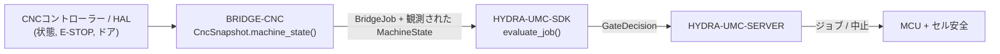

<!-- =============================================================================
HYDRA-UMC-BRIDGE-CNC - CNCセル連携ブリッジ
Copyright (C) 2026 JuanenRac (Electro Hobby 3D) <electrohobby3d@gmail.com>
GPL-3.0-or-later - see LICENSE
============================================================================= -->

<p align="center">
  
</p>

# 🔧 HYDRA-UMC-BRIDGE-CNC

<p align="center"><a href="README.md">🇺🇸 English</a> | <a href="README_spa.md">🇪🇸 Español</a> | <a href="README_fra.md">🇫🇷 Français</a> | <a href="README_ita.md">🇮🇹 Italiano</a> | <a href="README_deu.md">🇩🇪 Deutsch</a> | <a href="README_zho.md">🇨🇳 简体中文</a> | 🇯🇵 <b>日本語</b></p>

### 🛑 CNCセル向けフェイルセーフ連携ブリッジ

<p align="left">
  
  
  
</p>

---

## 1. 🛠️ 技術概要

**HYDRA-UMC-BRIDGE-CNC** は、CNCセルとHYDRA-UMCロボット補助装置とを結ぶ高レベルブリッジであり、搬入・搬出・部品ハンドリング、監視下にある補助タスクを扱う。実時間軌道コントローラーになることは決してない —— CNCコントローラー(LinuxCNCなど)が常に軌道・主軸・機械限界の権限を保持する。

本リポジトリは **External Automation Bridges** ファミリーに属する。CNC・LASER・OPENPNP・PRINTER3D・ROS2という兄弟リポジトリ群が、すべて `HYDRA-UMC-SDK` の同じ安全契約を共有しており、いずれのブリッジも独自の「作業に安全」という定義を勝手に作ることはできない。

### 主な機能:
* ✅ **実在するフェイルセーフなセルスナップショット:** `cell.py` の `CncSnapshot.machine_state()` は、コントローラーが報告する内容を見る*前に*E-STOPとドア状態を確認する —— E-STOPが作動しているか、ドアが閉じていない場合、`controller_state` の内容に関わらず常に `SAFE_STOP` へ解決される。*(実装済み、`tests/test_cell.py` でテスト済み)*
* ✅ **実在する共有安全ゲート:** 観測されたすべてのジョブは `HYDRA-UMC-SDK` の `bridge_contract` にある `evaluate_job()` を通じて再評価される。これは他のすべての兄弟ブリッジとHYDRA-UMC-SERVERが使うのと同じゲートである。*(実装済み)*
* ✅ **保守的な状態マッピング:** `IDLE` のみがアイドルとして扱われる。`RUN`/`RUNNING`/`HOLD` は `RUNNING` に、`FAULT`/`ERROR`/`OFF` は `FAULT` にマッピングされ、認識されない値はすべて `OFFLINE` にフォールバックする —— 生産的な作業を許可してしまうような状態には決してフォールバックしない。*(実装済み)*
* ✅ **読み取り専用のコントローラー証跡:** `observation.py` はローカルのマッピング証跡と供給された GRBL ステータス行を厳密に正規化する。E-STOP/ドア信号が欠落しているか、ブール値でない場合は安全側に倒れて失敗する。*(実装済み、`tests/test_observation.py` でテスト済み)*
* ✅ **実際の GRBL シリアル転送:** `serial_transport.py` の `GrblSerialProbe` は実際のシリアル接続を開き、GRBL のリアルタイムステータスバイト（`?`）を問い合わせる。`GrblRealtimeControl` は GRBL 自身のリアルタイム制御バイト（送り保持、サイクル再開、ソフトリセット）のみを送信する —— `cycle_start_resume()` はマシンが本当に `HOLDING` 状態のときのみゲートされ、他は `ABORT` のように常に許可される。G-code プログラムをストリーミングすることは決してない。*(実装済み、`tests/test_serial_transport.py` でテスト済み)*
* ✅ **非破壊的なビルド/テスト:** `build-test.bat`/`.sh` はソースをコンパイルし、バージョンファイルやCHANGELOGに一切触れずに安全ゲートのテストスイートを実行する。*(実装済み、下記「ビルドと実行」を参照)*
* 🔜 **LinuxCNC HALアダプター** —— 保留中。実際のCNCコントローラー、HALピン、ロボットはまだ一度も駆動されていない。*(計画中)*

---

## 2. 🔄 セル連携フロー



---

## 3. 🧱 アーキテクチャと設計判断

* **なぜE-STOPとドア状態をコントローラー自身の報告状態より先に確認するのか。** `CncSnapshot.machine_state()` は、`estop` が真であるか、あるいはドアが閉じていない場合、真っ先に `SAFE_STOP` へ短絡する —— ドアが開いたままなのに `IDLE` と報告し続けるコントローラーを、額面通りに信用してはならない。
* **なぜコントローラー状態のマッピングを意図的に保守的にしているのか。** 文字列 `IDLE` のみが `MachineState.IDLE` にマッピングされる。認識されない値はすべて `OFFLINE` にフォールバックし、補助作業を許可してしまうような状態には決してならない —— 未知のコントローラー状態は「わからない」として扱われ、「おそらく大丈夫」とは扱われない。
* **なぜブリッジは新しい `BridgeJob` を組み立て、独自の受理/拒否ロジックを書く代わりに共有の `evaluate_job()` に委譲するのか。** 5つのExternal Automation Bridges(CNC、LASER、OPENPNP、PRINTER3D、ROS2)はすべて `HYDRA-UMC-SDK` の全く同じ `bridge_contract` を再利用しており、「何をもってジョブ開始が安全とみなすか」がそれぞれの間で静かに食い違うことがない。
* **なぜLinuxCNC HALアダプターはまだこのリポジトリに含まれていないのか。** 実際のHALピンを配線することは、実物のコントローラーに対して検証すべきハードウェア/ソフトウェア統合ステップである。その検証前にここで実装済みだと主張することは、このローカルコアが裏付けできない主張になってしまう。
* **エコシステムの他部分とどう関係するか。** BRIDGE-CNCはCNCコントローラーと `HYDRA-UMC-SDK` → `HYDRA-UMC-SERVER` → MCU/セル安全との間に位置する。CNCの周辺で補助ロボット作業を調整するものであり、コントローラー自身の安全権限を置き換えたり上書きしたりすることはない。

---

## 📂 ディレクトリ構成

```text
HYDRA-UMC-BRIDGE-CNC/
├── src/
│   └── hydra_umc_bridge_cnc/
│       ├── __init__.py
│       ├── cell.py              # CncSnapshot + CncCellBridge 安全ゲート
│       ├── observation.py       # 読み取り専用マッピングとGRBLステータスの正規化
│       ├── serial_transport.py  # 実際のfail-closed GRBLシリアル転送 - ステータス照会とリアルタイム制御バイトのみ
│       └── mqtt_transport.py    # このbridgeの既存の実ロジック向けの実MQTTブローカー転送
├── tests/
│   ├── test_cell.py             # 安全アイドル許可、ドア開放時の拒否、中止転送
│   ├── test_observation.py      # 安全性の証拠が欠けている場合はfail-closedで失敗する
│   ├── test_serial_transport.py # 疑似ポートに対する実シリアル転送のテスト(fail-closedパスを含む)
│   └── test_mqtt_transport.py   # 疑似ブローカークライアントに対するMQTTコマンド/ステータス形状テスト
├── tools/
│   ├── build_test.py            # 非破壊的なコンパイル+テストランナー (build-test.bat/.sh)
│   └── bump_version.py          # pyproject.toml、マニフェスト、CHANGELOG.md を同期
├── docs/
│   ├── BRIDGE_GUIDE.md                    # 適用範囲、対応プラットフォーム、スクリプト、ハードウェア受け入れゲート
│   └── CONTROLLER_EVIDENCE_BOUNDARY.md    # 何が実際の安全性の証拠とみなされ、このbridgeが何を推測しないか
├── images/
│   └── HYDRA_UMC_BANNER.svg     # README バナー
├── build-test.bat / build-test.sh  # 検証のみ、リポジトリを一切変更しない
├── build.bat / build.sh            # 検証後、成功時のみバージョン + CHANGELOG を更新
├── pyproject.toml               # パッケージメタデータ。HYDRA-UMC-SDK に依存 (git)
├── hydra-umc.project.json       # エコシステムマニフェスト(バージョン、成熟度、ファミリー)
├── CHANGELOG.md
├── CODE_OF_CONDUCT.md / CONTRIBUTING.md / SECURITY.md / SUPPORT.md
├── LICENSE / LICENSE.md
└── README.md / README_*.md      # 本ファイルおよびその6言語訳
```

---

## 4. ⚙️ ビルドと実行

Python 3.11以上が必要。`tools/build_test.py` は `HYDRA-UMC-SDK` が兄弟ディレクトリ(`../HYDRA-UMC-SDK`)としてチェックアウトされているか、環境変数 `HYDRA_UMC_SDK_ROOT` で指定されていることを期待する。

```bash
# Windows
build-test.bat      # 検証のみ —— バージョン/CHANGELOGの変更なし
build.bat            # 検証後、成功時にバージョン + CHANGELOG を更新

# Linux/macOS
bash build-test.sh
bash build.sh
```

`build-test` は `src/` 配下の各モジュールを `py_compile` でコンパイルし、`unittest` の全スイート(`tests/test_cell.py`)を実行して、安全アイドル許可、ドア開放時の拒否、中止転送を実証する —— リポジトリを一切変更しない。`build` はまず同じ検証を実行し、成功した場合のみ `tools/bump_version.py` を呼び出して `pyproject.toml`、`hydra-umc.project.json`、`CHANGELOG.md` の間でバージョンを同期する。実際のCNC向け `run` コマンドはまだ存在しない —— それには検証済みのコントローラー統合が必要である。

---

## ✅ 現状と次のステップ

**現時点で実在するもの:** バージョン `0.0.7`。ローカルでテスト済みのフェイルセーフなセル調整器(`CncSnapshot` + `CncCellBridge`)が `HYDRA-UMC-SDK` の共有ジョブゲートの上に構築されており、GRBL v1.1 の実際のステータス語彙全体(実際の `Hold:N`/`Door:N` サブステートを含む `Idle`/`Run`/`Jog`/`Home`/`Hold`/`Alarm`/`Door`)に加えて MTConnect の実行状態もカバーする厳密な読み取り専用コントローラー証拠の正規化、実際の接続経由でステータスを問い合わせ GRBL 自身のリアルタイム制御バイトを送信できる実際のシリアル転送(`GrblSerialProbe`/`GrblRealtimeControl`)、決定論的な42件の `unittest` スイートと、SDKチェックアウトを伴いCIに組み込まれた非破壊的なbuild-testスクリプトを備える。

**統合境界:** CNCコントローラー(LinuxCNCなど)は常に軌道・主軸・機械限界の権限を保持する。このブリッジが調整するのはあくまで*補助的な*ロボット作業のみであり、コントローラー自身の動作には一切関与しない。

**今後の課題:** 実際のCNCコントローラー、LinuxCNC HALピン、ロボットはまだ一度も駆動されていない —— 具体的なHALアダプターの選定と検証は、実機とその文書化されたインターフェースが揃った後に行うハードウェア/ソフトウェア統合ステップである。

---

## 🔗 関連プロジェクト

本プロジェクトは、同じ作者(JuanenRac / Electro Hobby 3D)による HYDRA-UMC ロボティクスエコシステムの一部です。リクエストが実はこの中のどれかについてのものである可能性があるため、知っておく価値があります。

**親プロジェクト**
- **[HYDRA-UMC-SERVER](https://github.com/JuanenRac/HYDRA-UMC-SERVER)** — すべての制御クライアントが実際に通信する、本物のヘッドレスバックエンド(REST/WebSocket)。各コマンドがこのブリッジ自身のローカル安全ゲートを通過した後、本ブリッジが報告する認証済みエコシステム境界。

**兄弟プロジェクト** —— それぞれ独自のクライアントとして、同じく HYDRA-UMC-SERVER 自身の API と通信する
- **[HYDRA-UMC-STUDIO](https://github.com/JuanenRac/HYDRA-UMC-STUDIO)** — リアルタイムのマルチロボット 3D 可視化を備えたウェブ制御ダッシュボード。
- **[HYDRA-UMC-SUITE](https://github.com/JuanenRac/HYDRA-UMC-SUITE)** — 複数のサーバーを同時に扱えるデスクトップ(PySide6)スウォームコマンドセンター、スタンドアロン実行ファイルとしてパッケージ化。
- **[HYDRA-UMC-ANDROID-CONTROL](https://github.com/JuanenRac/HYDRA-UMC-ANDROID-CONTROL)** — 生体認証ログインとペアリングされた Wear OS コンパニオンを備えたネイティブ Android 制御アプリ。
- **[HYDRA-UMC-IOS-CONTROL](https://github.com/JuanenRac/HYDRA-UMC-IOS-CONTROL)** — リアルタイム WebSocket 同期を備えた iOS/iPadOS 制御アプリ(Flutter)。
- **[HYDRA-UMC-DSI](https://github.com/JuanenRac/HYDRA-UMC-DSI)** — 本体搭載の 7 インチ DSI タッチスクリーン向けネイティブタッチ UI、CM5 自体に組み込み。
- **[HYDRA-UMC-BRIDGE-AMR](https://github.com/JuanenRac/HYDRA-UMC-BRIDGE-AMR)** — 実際の VDA 5050 MQTT パブリッシャーによる AGV/AMR フリートの調整境界。
- **[HYDRA-UMC-BRIDGE-DROIDS](https://github.com/JuanenRac/HYDRA-UMC-BRIDGE-DROIDS)** — 実際の Boston Dynamics Spot コマンド送信機能を持つ、脚型/ヒューマノイドドロイドの調整境界。
- **[HYDRA-UMC-BRIDGE-LASER](https://github.com/JuanenRac/HYDRA-UMC-BRIDGE-LASER)** — 実際のキー/筐体/インターロック GPIO セーフガード 3 系統を読み取る、レーザーセルの安全コーディネーター。
- **[HYDRA-UMC-BRIDGE-OPENPNP](https://github.com/JuanenRac/HYDRA-UMC-BRIDGE-OPENPNP)** — OpenPnP ピックアンドプレースの基板フローを安全に統括する高レベルコーディネーター。
- **[HYDRA-UMC-BRIDGE-PRINTER3D](https://github.com/JuanenRac/HYDRA-UMC-BRIDGE-PRINTER3D)** — 実際にゲート制御されたジョブコマンドを持つ、Moonraker/Klipper 3D プリンター向けの安全な調整境界。
- **[HYDRA-UMC-BRIDGE-ROS2](https://github.com/JuanenRac/HYDRA-UMC-BRIDGE-ROS2)** — 実際の遅延インポート rclpy ROS 2 トランスポートを持つ安全コーディネーター。
- **[HYDRA-UMC-BRIDGE-UAV](https://github.com/JuanenRac/HYDRA-UMC-BRIDGE-UAV)** — 実際の MAVLink コマンド送信機能を持つ、カメラ搭載 UAV の調整境界。

**直接関連**
- **[HYDRA-UMC-SDK](https://github.com/JuanenRac/HYDRA-UMC-SDK)** — すべてのブリッジが自身のコマンドを検証する共有 JSON-Schema 契約と安全ゲートの境界。
- **[HYDRA-UMC-MQTT-BROKER](https://github.com/JuanenRac/HYDRA-UMC-MQTT-BROKER)** — このブリッジ自身の `hydra/bridges/cnc/...` トピック向けの `mqtt_transport.py` の実際のトランスポート——ステータスに加え jog/reset/resume の制御バイト、および共有ジョブゲート。詳細はそのリポジトリ自身の `docs/BRIDGE_TOPICS.md` を参照。
- **[HYDRA-UMC-HIL-BRIDGE](https://github.com/JuanenRac/HYDRA-UMC-HIL-BRIDGE)** — 実際のコントローラー統合に向けた将来のハードウェア・イン・ザ・ループ実証経路。

**エコシステムの他のプロジェクト**

*コアハードウェア&プラットフォーム*
- **[HYDRA-UMC](https://github.com/JuanenRac/HYDRA-UMC)** — 実際のロボットアームのマザーボード——CM5 ホスト + デュアルコア STM32H745、CAN-OTA/SPI-OTA 経由で最大 8 本のツールアームを統括。
- **[HYDRA-UMC-OS](https://github.com/JuanenRac/HYDRA-UMC-OS)** — CM5 向けの再現可能な Raspberry Pi OS プロダクト層——読み取り専用エージェント、検証済み設定/プロファイル、WiFi 初回接続プロビジョニング。

*コアバックエンド&クライアント*
- **[HYDRA-UMC-EDITOR-URDF](https://github.com/JuanenRac/HYDRA-UMC-EDITOR-URDF)** — 完成したモデルを STUDIO 自身のカタログへ送信するデスクトップ用グラフィカル URDF 作成/編集ツール。

*URTC ツールプラットフォーム*
- **[URTC](https://github.com/JuanenRac/URTC)** — 物理的な Universal Robot Tool Controller 基板向けファームウェア、CAN バス経由の 25 以上のツールプロファイル。
- **[URTC-FLASHER](https://github.com/JuanenRac/URTC-FLASHER)** — URTC 基板用のデスクトップ GUI 書き込みツール、CAN-OTA およびフルチップ SWD/JTAG。
- **[URTC-TESTER](https://github.com/JuanenRac/URTC-TESTER)** — URTC 基板向けのデスクトップ CAN バスライブ診断ツール、ツールプロファイルごとに 1 パネル。
- **[URTC-WEB-STUDIO](https://github.com/JuanenRac/URTC-WEB-STUDIO)** — Web Serial API を使ったブラウザベースの URTC-TESTER の代替、ローカルインストール不要。

*ビジョン AI ノード(Hailo-8)*
- **[HYDRA-UMC-VISION-NODE](https://github.com/JuanenRac/HYDRA-UMC-VISION-NODE)** — Hailo-8 ビジョンパイプラインの統合ハブ、段階ごとの実際のハードウェア準備状況チェック付き。
- **[HYDRA-UMC-DETECTION-HEF](https://github.com/JuanenRac/HYDRA-UMC-DETECTION-HEF)** — Hailo アーキテクチャ/チェックサムによる安全読み込み検証を備えた、実際のコンパイル済みモデルレジストリ。
- **[HYDRA-UMC-VISION-STREAMER](https://github.com/JuanenRac/HYDRA-UMC-VISION-STREAMER)** — 実際の HailoRT 統合境界を持つ、実際の GStreamer パイプライン + MediaMTX 設定生成器。
- **[HYDRA-UMC-VISUAL-SERVOING-API](https://github.com/JuanenRac/HYDRA-UMC-VISUAL-SERVOING-API)** — 上流のゾーン状態に応じて安全ゲート制御される、実際の Position-Based Visual Servoing 補正則。
- **[HYDRA-UMC-SAFETY-ZONES](https://github.com/JuanenRac/HYDRA-UMC-SAFETY-ZONES)** — キャリブレーションの鮮度を強制する、実際のゾーン侵入チェックと E-STOP 要求。

*コグニティブ AI ノード(Hailo-10)*
- **[HYDRA-UMC-COGNITIVE-NODE](https://github.com/JuanenRac/HYDRA-UMC-COGNITIVE-NODE)** — Hailo-10 コグニティブパイプライン(LLM/VLA/音声オーケストレーション)の統合ハブ。
- **[HYDRA-UMC-VLA-ENGINE](https://github.com/JuanenRac/HYDRA-UMC-VLA-ENGINE)** — Vision-Language-Action モデル向けの、実際のアクショントークンのエンコード/デコードと軌道生成。
- **[HYDRA-UMC-VOICE-UI](https://github.com/JuanenRac/HYDRA-UMC-VOICE-UI)** — 確認ゲート付きの限定的な Watch リレーを備えた、実際の音声フロントエンド(VAD + 意図解析)。
- **[HYDRA-UMC-SEMANTIC-PLANNER](https://github.com/JuanenRac/HYDRA-UMC-SEMANTIC-PLANNER)** — MCU エラーコードに対する、実際のルールベースのタスク分解と意味的エラー復旧。
- **[HYDRA-UMC-DOCS-QA](https://github.com/JuanenRac/HYDRA-UMC-DOCS-QA)** — このエコシステム自身の Markdown ドキュメントに対する、標準ライブラリのみの実際の TF-IDF 文書検索。

*オーケストレーション&スウォーム*
- **[HYDRA-UMC-ORCHESTRATOR](https://github.com/JuanenRac/HYDRA-UMC-ORCHESTRATOR)** — 実際の gRPC/Protobuf ヘルスレポート契約とミッションステートマシンを持つ統合ハブ。
- **[HYDRA-UMC-JOB-DISPATCHER](https://github.com/JuanenRac/HYDRA-UMC-JOB-DISPATCHER)** — 実際の HTTP API 上に構築された、優先度ベースの実際のジョブキュー(重複排除付き)。
- **[HYDRA-UMC-NODE-HEALING](https://github.com/JuanenRac/HYDRA-UMC-NODE-HEALING)** — リトライ/バックオフとアイデンティティ不一致検出を備えた、実際の gRPC ベースのフリートヘルスウォッチドッグ。
- **[HYDRA-UMC-PATH-PLANNER-3D](https://github.com/JuanenRac/HYDRA-UMC-PATH-PLANNER-3D)** — 実際の障害物/ワークスペース衝突検証を備えた、実際の RRT ベースの 3D 経路プランナー。
- **[HYDRA-UMC-SWARM-SYNC](https://github.com/JuanenRac/HYDRA-UMC-SWARM-SYNC)** — 複数セルの収束についてプロパティテストされた、実際の CRDT LWW-Element-Map 状態同期。

*デジタルツイン&シミュレーション*
- **[HYDRA-UMC-TWIN](https://github.com/JuanenRac/HYDRA-UMC-TWIN)** — 実際のバージョン互換性同期契約を持つ、デジタルツインエンジンの統合ハブ。
- **[HYDRA-UMC-PHYSICS-REPLICA](https://github.com/JuanenRac/HYDRA-UMC-PHYSICS-REPLICA)** — 実際の URDF サブセットに対する、実際の順運動学と関節限界検証。
- **[HYDRA-UMC-SYNTHETIC-DATA-GEN](https://github.com/JuanenRac/HYDRA-UMC-SYNTHETIC-DATA-GEN)** — YOLO/COCO アノテーションのエクスポート機能を持つ、実際のプロシージャル 2D シーンジェネレーター。

*データ&分析*
- **[HYDRA-UMC-DATALAKE](https://github.com/JuanenRac/HYDRA-UMC-DATALAKE)** — 実際の取り込み/クエリ HTTP API を備えた、実際の sqlite3 ベースの時系列ストア。
- **[HYDRA-UMC-ANOMALY-DETECTOR](https://github.com/JuanenRac/HYDRA-UMC-ANOMALY-DETECTOR)** — ドリフト監視を備えた、実際の FFT + 統計ベースラインによる異常検知器。
- **[HYDRA-UMC-PRODUCTION-REPORTS](https://github.com/JuanenRac/HYDRA-UMC-PRODUCTION-REPORTS)** — DATALAKE の履歴に対する実際の OEE/稼働率計算、再現可能な CSV エクスポート付き。
- **[HYDRA-UMC-TELEMETRY-COLLECTOR](https://github.com/JuanenRac/HYDRA-UMC-TELEMETRY-COLLECTOR)** — シーケンス重複排除機能を備えた、DATALAKE への実際の CAN/WebSocket 取り込みパイプライン。

*産業用ゲートウェイ*
- **[HYDRA-UMC-GATEWAY-INDUSTRIAL](https://github.com/JuanenRac/HYDRA-UMC-GATEWAY-INDUSTRIAL)** — 実際のコマンド許可リスト/バックプレッシャー層を持つ、産業用プロトコルへ中継する統合ハブ。
- **[HYDRA-UMC-OPCUA-SERVER](https://github.com/JuanenRac/HYDRA-UMC-OPCUA-SERVER)** — 実際のバイナリプロトコルクライアントセッションで検証された、実際の OPC-UA アドレス空間。
- **[HYDRA-UMC-MTCONNECT-ADAPTER](https://github.com/JuanenRac/HYDRA-UMC-MTCONNECT-ADAPTER)** — 縮退モード出力を備えた、実際の MTConnect `/probe` および `/current` XML エンドポイント。

*補完ツール&エコシステム運用*
- **[HYDRA-UMC-DASHBOARD-AI](https://github.com/JuanenRac/HYDRA-UMC-DASHBOARD-AI)** — 誠実な統計フォールバックを備えた、DATALAKE/ANOMALY-DETECTOR 上のスマートサマリーと異常ハイライトパネル。
- **[HYDRA-UMC-TOOL-CLI](https://github.com/JuanenRac/HYDRA-UMC-TOOL-CLI)** — 実際の安定した終了コード契約を持つフリート CLI、HYDRA-UMC-SERVER 自身の API の本物のライブクライアント。
- **[HYDRA-UMC-WATCH](https://github.com/JuanenRac/HYDRA-UMC-WATCH)** — 実際の触覚アラートとペアリングされたスマートフォンへの音声リレーを備えた WearOS コンパニオンアプリ。
- **[URTC-SMART-RACK](https://github.com/JuanenRac/URTC-SMART-RACK)** — 実際の工具 ID デコードと Smart Idle 予熱ロジックを備えた、基板搭載ラック用ファームウェア。
- **[URTC-VISION-TOOL](https://github.com/JuanenRac/URTC-VISION-TOOL)** — サーマル/RGB 検査ツールヘッド向けの、ファームウェアと実際の Python ビジョンコンパニオン。
- **[HYDRA-UMC-UPDATER](https://github.com/JuanenRac/HYDRA-UMC-UPDATER)** — このエコシステム内のすべてのリポジトリを検出・クローン・更新する、管理用デスクトップツール。

---

## 📚 ドキュメント & コミュニティ

- **[CONTRIBUTING.md](CONTRIBUTING.md)** —— プルリクエストのための技術スタックとコーディング指針。
- **[CODE_OF_CONDUCT.md](CODE_OF_CONDUCT.md)** —— このコミュニティで期待される行動規範。
- **[SECURITY.md](SECURITY.md)** —— 脆弱性の報告方法と、このプロジェクトの実際のセキュリティ重点領域。
- **[SUPPORT.md](SUPPORT.md)** —— 質問の投稿先とバグの報告先。
- **[LICENSE.md](LICENSE.md)** —— このプロジェクト自身のライセンス。

## 👤 作者
**JuanenRac** (Electro Hobby 3D)
📧 electrohobby3d@gmail.com
📺 [youtube.com/@electrohobby3d](https://youtube.com/@electrohobby3d)

## 📜 ライセンス
GPL-3.0 - 詳細はLICENSEを参照。
