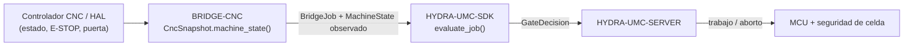

<!-- =============================================================================
HYDRA-UMC-BRIDGE-CNC - Puente de coordinación de celda CNC
Copyright (C) 2026 JuanenRac (Electro Hobby 3D) <electrohobby3d@gmail.com>
GPL-3.0-or-later - see LICENSE
============================================================================= -->

<p align="center">
  
</p>

# 🔧 HYDRA-UMC-BRIDGE-CNC

<p align="center"><a href="README.md">🇺🇸 English</a> | 🇪🇸 <b>Español</b> | <a href="README_fra.md">🇫🇷 Français</a> | <a href="README_ita.md">🇮🇹 Italiano</a> | <a href="README_deu.md">🇩🇪 Deutsch</a> | <a href="README_zho.md">🇨🇳 简体中文</a> | <a href="README_jpn.md">🇯🇵 日本語</a></p>

### 🛑 Puente de coordinación seguro por defecto para celdas CNC

<p align="left">
  
  
  
</p>

---

## 1. 🛠️ VISIÓN TÉCNICA GENERAL

**HYDRA-UMC-BRIDGE-CNC** es el puente de alto nivel entre celdas CNC y auxiliares robóticos HYDRA-UMC: carga, descarga, manipulación de piezas y tareas auxiliares supervisadas. Nunca se convierte en un controlador de trayectorias en tiempo real: el controlador CNC (LinuxCNC u otro) conserva en todo momento la autoridad sobre trayectoria, husillo y límites de máquina.

Pertenece a la familia **External Automation Bridges**: un conjunto de repositorios hermanos (CNC, LASER, OPENPNP, PRINTER3D, ROS2) que hablan el mismo contrato de seguridad compartido de `HYDRA-UMC-SDK`, de modo que ningún puente puede inventar su propia definición de "seguro para trabajar".

### Características clave:
* ✅ **Instantánea de celda segura por defecto, real:** `cell.py` — `CncSnapshot.machine_state()` comprueba el E-STOP y el estado de la puerta *antes* de mirar nada que reporte el controlador; un E-STOP activo o una puerta abierta siempre resuelven en `SAFE_STOP`, sin importar lo que diga `controller_state`. *(implementado, probado en `tests/test_cell.py`)*
* ✅ **Puerta de seguridad compartida, real:** cada trabajo observado se reevalúa mediante `evaluate_job()` de `bridge_contract` en `HYDRA-UMC-SDK`, la misma puerta que usan todos los puentes hermanos y HYDRA-UMC-SERVER. *(implementado)*
* ✅ **Mapeo de estado conservador:** solo `IDLE` se trata como reposo; `RUN`/`RUNNING`/`HOLD` se mapean a `RUNNING`, `FAULT`/`ERROR`/`OFF` a `FAULT`, y cualquier valor no reconocido cae en `OFFLINE`, nunca en un estado que permitiría trabajo productivo. *(implementado)*
* ✅ **Evidencia del controlador de solo lectura:** `observation.py` normaliza estrictamente la evidencia de mapeo local y las líneas de estado GRBL recibidas; las señales de E-STOP/puerta omitidas o no booleanas fallan de forma segura. *(implementado, probado en `tests/test_observation.py`)*
* ✅ **Transporte serie GRBL real:** `GrblSerialProbe` de `serial_transport.py` abre una conexión serie real y consulta el byte de estado en tiempo real de GRBL (`?`); `GrblRealtimeControl` solo envía los bytes de control en tiempo real propios de GRBL (retención de avance, reanudación de ciclo, reinicio suave) — `cycle_start_resume()` está condicionado a que la máquina esté genuinamente en `HOLDING`, los demás siempre están permitidos como `ABORT`. Nunca transmite un programa G-code. *(implementado, probado en `tests/test_serial_transport.py`)*
* ✅ **Compilación/prueba no mutante:** `build-test.bat`/`.sh` compilan el código y ejecutan la batería de pruebas de la puerta de seguridad sin tocar archivos de versión ni el CHANGELOG. *(implementado, ver COMPILACIÓN Y EJECUCIÓN más abajo)*
* 🔜 **Adaptador LinuxCNC HAL** — aplazado; todavía no se ha accionado un controlador CNC, un pin HAL ni un robot real. *(planeado)*

---

## 2. 🔄 FLUJO DE COORDINACIÓN DE CELDA



---

## 3. 🧱 ARQUITECTURA Y DECISIONES DE DISEÑO

* **Por qué se comprueban el E-STOP y el estado de puerta antes que el propio estado reportado por el controlador.** `CncSnapshot.machine_state()` cortocircuita a `SAFE_STOP` si hay `estop` o la puerta no está cerrada, antes que nada — un controlador que sigue reportando `IDLE` con la puerta abierta jamás debe tomarse al pie de la letra.
* **Por qué el mapeo del estado del controlador es deliberadamente conservador.** Solo la cadena literal `IDLE` se mapea a `MachineState.IDLE`. Cualquier valor no reconocido cae en `OFFLINE`, nunca en algo que permitiría trabajo auxiliar — un estado de controlador desconocido se trata como "no lo sé", no como "probablemente está bien".
* **Por qué el puente construye un nuevo `BridgeJob` y delega en el `evaluate_job()` compartido en lugar de escribir su propia lógica de aceptación/rechazo.** Los cinco External Automation Bridges (CNC, LASER, OPENPNP, PRINTER3D, ROS2) reutilizan exactamente el mismo `bridge_contract` de `HYDRA-UMC-SDK`, de modo que "qué cuenta como seguro para iniciar un trabajo" no puede divergir silenciosamente entre ellos.
* **Por qué el adaptador LinuxCNC HAL todavía no está en este repositorio.** Cablear pines HAL reales es un paso de integración de hardware/software que hay que validar contra un controlador real; afirmarlo aquí antes de esa validación sería una afirmación que este núcleo local no puede respaldar.
* **Cómo encaja en el resto del ecosistema.** BRIDGE-CNC se sitúa entre el controlador CNC y `HYDRA-UMC-SDK` → `HYDRA-UMC-SERVER` → MCU/seguridad de celda: coordina trabajo robótico auxiliar alrededor del CNC, no reemplaza ni anula la propia autoridad de seguridad del controlador.

---

## 📂 ESTRUCTURA DE DIRECTORIOS

```text
HYDRA-UMC-BRIDGE-CNC/
├── src/
│   └── hydra_umc_bridge_cnc/
│       ├── __init__.py
│       ├── cell.py              # Puerta de seguridad CncSnapshot + CncCellBridge
│       ├── observation.py       # Mapeo de solo lectura y normalización del estado GRBL
│       ├── serial_transport.py  # Transporte serie GRBL real y fail-closed - solo consultas de estado y bytes de control en tiempo real
│       └── mqtt_transport.py    # Transporte MQTT real del broker para la lógica ya real de este bridge
├── tests/
│   ├── test_cell.py             # Admisión en reposo seguro, rechazo con puerta abierta, reenvío de aborto
│   ├── test_observation.py      # La evidencia de seguridad ausente falla cerrado
│   ├── test_serial_transport.py # Transporte serie real contra un puerto simulado, incl. rutas fail-closed
│   └── test_mqtt_transport.py   # Tests de forma de comando/estado MQTT contra un cliente de broker simulado
├── tools/
│   ├── build_test.py            # Compilador + ejecutor de pruebas no mutante (build-test.bat/.sh)
│   └── bump_version.py          # Sincroniza pyproject.toml, manifiesto y CHANGELOG.md
├── docs/
│   ├── BRIDGE_GUIDE.md                    # Alcance, plataformas compatibles, scripts, puerta de aceptación de hardware
│   └── CONTROLLER_EVIDENCE_BOUNDARY.md    # Qué cuenta como evidencia de seguridad real y qué se niega a inferir este bridge
├── images/
│   └── HYDRA_UMC_BANNER.svg     # Banner del README
├── build-test.bat / build-test.sh  # Solo valida, nunca modifica el repositorio
├── build.bat / build.sh            # Valida y, solo si tiene éxito, sube versión + CHANGELOG
├── pyproject.toml               # Metadatos del paquete; depende de HYDRA-UMC-SDK (git)
├── hydra-umc.project.json       # Manifiesto del ecosistema (versión, madurez, familia)
├── CHANGELOG.md
├── CODE_OF_CONDUCT.md / CONTRIBUTING.md / SECURITY.md / SUPPORT.md
├── LICENSE / LICENSE.md
└── README.md / README_*.md      # Este archivo y sus 6 traducciones
```

---

## 4. ⚙️ COMPILACIÓN Y EJECUCIÓN

Requiere Python 3.11+. `tools/build_test.py` espera que `HYDRA-UMC-SDK` esté clonado como directorio hermano (`../HYDRA-UMC-SDK`) o indicado mediante la variable de entorno `HYDRA_UMC_SDK_ROOT`.

```bash
# Windows
build-test.bat      # solo valida — sin cambio de versión/CHANGELOG
build.bat            # valida y, si tiene éxito, sube versión + CHANGELOG

# Linux/macOS
bash build-test.sh
bash build.sh
```

`build-test` compila cada módulo bajo `src/` con `py_compile` y ejecuta la batería completa de `unittest` (`tests/test_cell.py`), demostrando la admisión en reposo seguro, el rechazo con puerta abierta y el reenvío de aborto — nunca modifica el repositorio. `build` ejecuta primero esa misma validación y, solo si tiene éxito, llama a `tools/bump_version.py` para sincronizar la versión en `pyproject.toml`, `hydra-umc.project.json` y `CHANGELOG.md`. Todavía no existe un comando `run` real de CNC — eso requiere una integración de controlador validada.

---

## ✅ ESTADO ACTUAL Y PRÓXIMOS PASOS

**Real hoy:** versión `0.0.7`, un coordinador de celda seguro por defecto probado en local (`CncSnapshot` + `CncCellBridge`) apoyado en la puerta de trabajo compartida de `HYDRA-UMC-SDK`, normalización estricta y de solo lectura de evidencia de controlador que cubre el vocabulario de estado real completo de GRBL v1.1 incluyendo subestados reales `Hold:N`/`Door:N` (`Idle`/`Run`/`Jog`/`Home`/`Hold`/`Alarm`/`Door`) además de estados de ejecución MTConnect, un transporte serie real (`GrblSerialProbe`/`GrblRealtimeControl`) capaz de consultar el estado y enviar los bytes de control en tiempo real propios de GRBL sobre una conexión real, una batería `unittest` determinista de cuarenta y dos pruebas, y scripts de build-test no mutantes conectados a CI con clonado del SDK.

**Frontera de integración:** el controlador CNC (LinuxCNC u otro) conserva en todo momento la autoridad sobre trayectoria, husillo y límites de máquina; este puente solo controla trabajo robótico *auxiliar*, nunca el movimiento del controlador.

**Todavía pendiente:** no se ha accionado ningún controlador CNC real, pin HAL de LinuxCNC ni robot — elegir y validar un adaptador HAL concreto es un paso de integración de hardware/software posterior a disponer de la máquina y su interfaz documentada.

---

## 🔗 Proyectos Relacionados

Este proyecto es parte del ecosistema de robótica HYDRA-UMC del mismo autor (JuanenRac / Electro Hobby 3D). Vale la pena conocerlo, ya que una petición podría en realidad ser sobre alguno de estos en vez de sobre este repositorio.

**Proyecto Padre**
- **[HYDRA-UMC-SERVER](https://github.com/JuanenRac/HYDRA-UMC-SERVER)** — el backend headless real (REST/WebSocket) con el que habla de verdad cada cliente de control; la frontera autenticada del ecosistema a la que reporta este bridge una vez cada comando ha superado la barrera de seguridad local de este propio bridge.

**Proyectos Hermanos** — también hablan con la propia API de HYDRA-UMC-SERVER, cada uno como su propio cliente
- **[HYDRA-UMC-STUDIO](https://github.com/JuanenRac/HYDRA-UMC-STUDIO)** — panel de control web con visualización 3D multi-robot en tiempo real.
- **[HYDRA-UMC-SUITE](https://github.com/JuanenRac/HYDRA-UMC-SUITE)** — centro de mando de enjambre de escritorio (PySide6) para varios servidores a la vez, empaquetado como ejecutable independiente.
- **[HYDRA-UMC-ANDROID-CONTROL](https://github.com/JuanenRac/HYDRA-UMC-ANDROID-CONTROL)** — app nativa de control para Android con inicio de sesión biométrico y un compañero Wear OS emparejado.
- **[HYDRA-UMC-IOS-CONTROL](https://github.com/JuanenRac/HYDRA-UMC-IOS-CONTROL)** — app de control para iOS/iPadOS (Flutter) con sincronización en tiempo real por WebSocket.
- **[HYDRA-UMC-DSI](https://github.com/JuanenRac/HYDRA-UMC-DSI)** — interfaz táctil nativa para la pantalla táctil DSI de 7" a bordo, embebida en el propio CM5.
- **[HYDRA-UMC-BRIDGE-AMR](https://github.com/JuanenRac/HYDRA-UMC-BRIDGE-AMR)** — barrera de coordinación para flotas AGV/AMR mediante un publicador MQTT VDA 5050 real.
- **[HYDRA-UMC-BRIDGE-DROIDS](https://github.com/JuanenRac/HYDRA-UMC-BRIDGE-DROIDS)** — barrera de coordinación para droides con patas/humanoides, con un emisor de comandos real para Boston Dynamics Spot.
- **[HYDRA-UMC-BRIDGE-LASER](https://github.com/JuanenRac/HYDRA-UMC-BRIDGE-LASER)** — coordinador de seguridad para celdas láser que lee 3 salvaguardas GPIO reales de llave/carcasa/enclavamiento.
- **[HYDRA-UMC-BRIDGE-OPENPNP](https://github.com/JuanenRac/HYDRA-UMC-BRIDGE-OPENPNP)** — coordinador de alto nivel seguro para el flujo de placas de pick-and-place OpenPnP.
- **[HYDRA-UMC-BRIDGE-PRINTER3D](https://github.com/JuanenRac/HYDRA-UMC-BRIDGE-PRINTER3D)** — barrera de coordinación segura para impresoras 3D Moonraker/Klipper, con comandos de trabajo reales y controlados.
- **[HYDRA-UMC-BRIDGE-ROS2](https://github.com/JuanenRac/HYDRA-UMC-BRIDGE-ROS2)** — coordinador de seguridad con un transporte ROS 2 rclpy real, importado de forma perezosa.
- **[HYDRA-UMC-BRIDGE-UAV](https://github.com/JuanenRac/HYDRA-UMC-BRIDGE-UAV)** — barrera de coordinación para UAV equipados con cámara, con un emisor de comandos MAVLink real.

**Directamente Relacionados**
- **[HYDRA-UMC-SDK](https://github.com/JuanenRac/HYDRA-UMC-SDK)** — el contrato JSON-Schema compartido y la barrera de seguridad contra la que cada bridge valida sus comandos.
- **[HYDRA-UMC-MQTT-BROKER](https://github.com/JuanenRac/HYDRA-UMC-MQTT-BROKER)** — el transporte real de `mqtt_transport.py` para los propios tópicos `hydra/bridges/cnc/...` de este bridge — estado más los bytes de control de jog/reset/resume, junto con la barrera de trabajos compartida; ver el propio `docs/BRIDGE_TOPICS.md` de ese repositorio.
- **[HYDRA-UMC-HIL-BRIDGE](https://github.com/JuanenRac/HYDRA-UMC-HIL-BRIDGE)** — futuro camino de evidencia hardware-in-the-loop para la integración real del controlador.

**También Forma Parte del Ecosistema**

*Hardware y Plataforma Base*
- **[HYDRA-UMC](https://github.com/JuanenRac/HYDRA-UMC)** — la placa madre física del brazo robótico: host CM5 + coprocesador STM32H745 de doble núcleo, coordinando hasta 8 brazos herramienta por CAN-OTA/SPI-OTA.
- **[HYDRA-UMC-OS](https://github.com/JuanenRac/HYDRA-UMC-OS)** — capa de producto reproducible sobre Raspberry Pi OS para el CM5: agente de solo lectura, config/perfiles validados, aprovisionamiento WiFi de primer contacto.

*Backend Central y Clientes*
- **[HYDRA-UMC-EDITOR-URDF](https://github.com/JuanenRac/HYDRA-UMC-EDITOR-URDF)** — creador/editor gráfico de URDF de escritorio que envía los modelos terminados al propio catálogo de STUDIO.

*Plataforma de Herramientas URTC*
- **[URTC](https://github.com/JuanenRac/URTC)** — firmware para la placa física del Universal Robot Tool Controller, más de 25 perfiles de herramienta por bus CAN.
- **[URTC-FLASHER](https://github.com/JuanenRac/URTC-FLASHER)** — herramienta de escritorio con GUI para flashear placas URTC, CAN-OTA más SWD/JTAG de chip completo.
- **[URTC-TESTER](https://github.com/JuanenRac/URTC-TESTER)** — herramienta de escritorio de diagnóstico CAN-bus en vivo para placas URTC, un panel por perfil de herramienta.
- **[URTC-WEB-STUDIO](https://github.com/JuanenRac/URTC-WEB-STUDIO)** — alternativa basada en navegador a URTC-TESTER mediante la Web Serial API, sin instalación local.

*Nodo IA de Visión (Hailo-8)*
- **[HYDRA-UMC-VISION-NODE](https://github.com/JuanenRac/HYDRA-UMC-VISION-NODE)** — nodo de integración para el pipeline de visión Hailo-8, con una comprobación real de disponibilidad de hardware por etapa.
- **[HYDRA-UMC-DETECTION-HEF](https://github.com/JuanenRac/HYDRA-UMC-DETECTION-HEF)** — registro real de modelos compilados con verificación de carga segura por arquitectura Hailo/checksum.
- **[HYDRA-UMC-VISION-STREAMER](https://github.com/JuanenRac/HYDRA-UMC-VISION-STREAMER)** — generador real de pipeline GStreamer + config MediaMTX, con una frontera de integración HailoRT real.
- **[HYDRA-UMC-VISUAL-SERVOING-API](https://github.com/JuanenRac/HYDRA-UMC-VISUAL-SERVOING-API)** — ley de corrección real de Position-Based Visual Servoing, con puerta de seguridad según el estado de zona previo.
- **[HYDRA-UMC-SAFETY-ZONES](https://github.com/JuanenRac/HYDRA-UMC-SAFETY-ZONES)** — comprobación real de invasión de zona y solicitud de E-STOP, con exigencia de vigencia de calibración.

*Nodo IA Cognitivo (Hailo-10)*
- **[HYDRA-UMC-COGNITIVE-NODE](https://github.com/JuanenRac/HYDRA-UMC-COGNITIVE-NODE)** — nodo de integración para el pipeline cognitivo Hailo-10 (orquestación de LLM/VLA/voz).
- **[HYDRA-UMC-VLA-ENGINE](https://github.com/JuanenRac/HYDRA-UMC-VLA-ENGINE)** — codificación/decodificación real de tokens de acción y generación de trayectoria para un modelo Vision-Language-Action.
- **[HYDRA-UMC-VOICE-UI](https://github.com/JuanenRac/HYDRA-UMC-VOICE-UI)** — front-end de voz real (VAD + analizador de intención) con un relé a Watch acotado y con confirmación.
- **[HYDRA-UMC-SEMANTIC-PLANNER](https://github.com/JuanenRac/HYDRA-UMC-SEMANTIC-PLANNER)** — descomposición real de tareas basada en reglas y recuperación semántica de errores sobre códigos de error del MCU.
- **[HYDRA-UMC-DOCS-QA](https://github.com/JuanenRac/HYDRA-UMC-DOCS-QA)** — búsqueda real de documentos TF-IDF (solo librería estándar) sobre los propios documentos Markdown de este ecosistema.

*Orquestación y Enjambre*
- **[HYDRA-UMC-ORCHESTRATOR](https://github.com/JuanenRac/HYDRA-UMC-ORCHESTRATOR)** — nodo de integración con un contrato real de informe de salud gRPC/Protobuf y una máquina de estados de misión.
- **[HYDRA-UMC-JOB-DISPATCHER](https://github.com/JuanenRac/HYDRA-UMC-JOB-DISPATCHER)** — cola de trabajos real basada en prioridad con deduplicación, sobre una API HTTP real.
- **[HYDRA-UMC-NODE-HEALING](https://github.com/JuanenRac/HYDRA-UMC-NODE-HEALING)** — watchdog de salud de flota real basado en gRPC, con reintento/backoff y detección de discrepancia de identidad.
- **[HYDRA-UMC-PATH-PLANNER-3D](https://github.com/JuanenRac/HYDRA-UMC-PATH-PLANNER-3D)** — planificador de rutas 3D real basado en RRT, con validación real de colisión de obstáculos/espacio de trabajo.
- **[HYDRA-UMC-SWARM-SYNC](https://github.com/JuanenRac/HYDRA-UMC-SWARM-SYNC)** — sincronización de estado real mediante CRDT LWW-Element-Map, con pruebas de propiedades para convergencia multi-celda.

*Gemelo Digital y Simulación*
- **[HYDRA-UMC-TWIN](https://github.com/JuanenRac/HYDRA-UMC-TWIN)** — nodo de integración para el motor de gemelo digital, con un contrato real de sincronización por compatibilidad de versión.
- **[HYDRA-UMC-PHYSICS-REPLICA](https://github.com/JuanenRac/HYDRA-UMC-PHYSICS-REPLICA)** — cinemática directa real y validación de límites articulares sobre un subconjunto real de URDF.
- **[HYDRA-UMC-SYNTHETIC-DATA-GEN](https://github.com/JuanenRac/HYDRA-UMC-SYNTHETIC-DATA-GEN)** — generador real de escenas 2D procedurales con exportación de anotaciones YOLO/COCO.

*Datos y Analítica*
- **[HYDRA-UMC-DATALAKE](https://github.com/JuanenRac/HYDRA-UMC-DATALAKE)** — almacén de series temporales real respaldado por sqlite3, con una API HTTP real de ingesta/consulta.
- **[HYDRA-UMC-ANOMALY-DETECTOR](https://github.com/JuanenRac/HYDRA-UMC-ANOMALY-DETECTOR)** — detector de anomalías real basado en FFT + línea base estadística, con monitorización de deriva.
- **[HYDRA-UMC-PRODUCTION-REPORTS](https://github.com/JuanenRac/HYDRA-UMC-PRODUCTION-REPORTS)** — cálculo real de OEE/disponibilidad sobre el histórico de DATALAKE, con exportación CSV reproducible.
- **[HYDRA-UMC-TELEMETRY-COLLECTOR](https://github.com/JuanenRac/HYDRA-UMC-TELEMETRY-COLLECTOR)** — pipeline real de ingesta CAN/WebSocket hacia DATALAKE, con deduplicación por secuencia.

*Pasarela Industrial*
- **[HYDRA-UMC-GATEWAY-INDUSTRIAL](https://github.com/JuanenRac/HYDRA-UMC-GATEWAY-INDUSTRIAL)** — nodo de integración que retransmite a protocolos industriales, con una capa real de lista blanca de comandos/contrapresión.
- **[HYDRA-UMC-OPCUA-SERVER](https://github.com/JuanenRac/HYDRA-UMC-OPCUA-SERVER)** — espacio de direcciones OPC-UA real, verificado con una sesión de cliente real del protocolo binario.
- **[HYDRA-UMC-MTCONNECT-ADAPTER](https://github.com/JuanenRac/HYDRA-UMC-MTCONNECT-ADAPTER)** — endpoints XML reales `/probe` y `/current` de MTConnect, con salida en modo degradado.

*Herramientas Complementarias y Operaciones del Ecosistema*
- **[HYDRA-UMC-DASHBOARD-AI](https://github.com/JuanenRac/HYDRA-UMC-DASHBOARD-AI)** — paneles de Resúmenes Inteligentes y Resaltado de Anomalías sobre DATALAKE/ANOMALY-DETECTOR, con un respaldo estadístico honesto.
- **[HYDRA-UMC-TOOL-CLI](https://github.com/JuanenRac/HYDRA-UMC-TOOL-CLI)** — CLI de flota con un contrato real y estable de códigos de salida, cliente real y en vivo de la propia API de HYDRA-UMC-SERVER.
- **[HYDRA-UMC-WATCH](https://github.com/JuanenRac/HYDRA-UMC-WATCH)** — app compañera de WearOS con alertas hápticas reales y un relé de voz al teléfono emparejado.
- **[URTC-SMART-RACK](https://github.com/JuanenRac/URTC-SMART-RACK)** — firmware para un rack de montaje de placas con decodificación real de ID de herramienta y lógica de precalentamiento Smart Idle.
- **[URTC-VISION-TOOL](https://github.com/JuanenRac/URTC-VISION-TOOL)** — firmware más un compañero de visión real en Python para un cabezal de inspección térmica/RGB.
- **[HYDRA-UMC-UPDATER](https://github.com/JuanenRac/HYDRA-UMC-UPDATER)** — herramienta administrativa de escritorio que descubre, clona y actualiza cada repositorio de este ecosistema.

## 👤 AUTOR
**JuanenRac** (Electro Hobby 3D)
📧 electrohobby3d@gmail.com
📺 [youtube.com/@electrohobby3d](https://youtube.com/@electrohobby3d)

## 📜 LICENCIA
GPL-3.0 - Ver LICENSE para más detalles.
