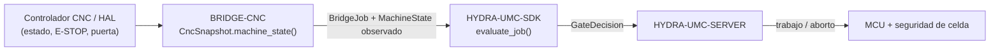

<!-- =============================================================================
HYDRA-UMC-BRIDGE-CNC - Puente de coordinación de celda CNC
Copyright (C) 2026 JuanenRac (Electro Hobby 3D) <electrohobby3d@gmail.com>
GPL-3.0-or-later - see LICENSE
============================================================================= -->

<p align="center">
  
</p>

# 🔧 HYDRA-UMC-BRIDGE-CNC

<p align="center"><a href="README.md">🇺🇸 English</a> | 🇪🇸 <b>Español</b> | <a href="README_fra.md">🇫🇷 Français</a> | <a href="README_ita.md">🇮🇹 Italiano</a> | <a href="README_deu.md">🇩🇪 Deutsch</a> | <a href="README_zho.md">🇨🇳 简体中文</a> | <a href="README_jpn.md">🇯🇵 日本語</a></p>

### 🛑 Puente de coordinación seguro por defecto para celdas CNC

<p align="left">
  
  
  
</p>

---

## 1. 🛠️ VISIÓN TÉCNICA GENERAL

**HYDRA-UMC-BRIDGE-CNC** es el puente de alto nivel entre celdas CNC y auxiliares robóticos HYDRA-UMC: carga, descarga, manipulación de piezas y tareas auxiliares supervisadas. Nunca se convierte en un controlador de trayectorias en tiempo real: el controlador CNC (LinuxCNC u otro) conserva en todo momento la autoridad sobre trayectoria, husillo y límites de máquina.

Pertenece a la familia **External Automation Bridges**: un conjunto de repositorios hermanos (CNC, LASER, OPENPNP, PRINTER3D, ROS2) que hablan el mismo contrato de seguridad compartido de `HYDRA-UMC-SDK`, de modo que ningún puente puede inventar su propia definición de "seguro para trabajar".

### Características clave:
* ✅ **Instantánea de celda segura por defecto, real:** `cell.py` — `CncSnapshot.machine_state()` comprueba el E-STOP y el estado de la puerta *antes* de mirar nada que reporte el controlador; un E-STOP activo o una puerta abierta siempre resuelven en `SAFE_STOP`, sin importar lo que diga `controller_state`. *(implementado, probado en `tests/test_cell.py`)*
* ✅ **Puerta de seguridad compartida, real:** cada trabajo observado se reevalúa mediante `evaluate_job()` de `bridge_contract` en `HYDRA-UMC-SDK`, la misma puerta que usan todos los puentes hermanos y HYDRA-UMC-SERVER. *(implementado)*
* ✅ **Mapeo de estado conservador:** solo `IDLE` se trata como reposo; `RUN`/`RUNNING`/`HOLD` se mapean a `RUNNING`, `FAULT`/`ERROR`/`OFF` a `FAULT`, y cualquier valor no reconocido cae en `OFFLINE`, nunca en un estado que permitiría trabajo productivo. *(implementado)*
* ✅ **Evidencia del controlador de solo lectura:** `observation.py` normaliza estrictamente la evidencia de mapeo local y las líneas de estado GRBL recibidas; las señales de E-STOP/puerta omitidas o no booleanas fallan de forma segura. *(implementado, probado en `tests/test_observation.py`)*
* ✅ **Transporte serie GRBL real:** `GrblSerialProbe` de `serial_transport.py` abre una conexión serie real y consulta el byte de estado en tiempo real de GRBL (`?`); `GrblRealtimeControl` solo envía los bytes de control en tiempo real propios de GRBL (retención de avance, reanudación de ciclo, reinicio suave) — `cycle_start_resume()` está condicionado a que la máquina esté genuinamente en `HOLDING`, los demás siempre están permitidos como `ABORT`. Nunca transmite un programa G-code. *(implementado, probado en `tests/test_serial_transport.py`)*
* ✅ **Compilación/prueba no mutante:** `build-test.bat`/`.sh` compilan el código y ejecutan la batería de pruebas de la puerta de seguridad sin tocar archivos de versión ni el CHANGELOG. *(implementado, ver COMPILACIÓN Y EJECUCIÓN más abajo)*
* 🔜 **Adaptador LinuxCNC HAL** — aplazado; todavía no se ha accionado un controlador CNC, un pin HAL ni un robot real. *(planeado)*

---

## 2. 🔄 FLUJO DE COORDINACIÓN DE CELDA



---

## 3. 🧱 ARQUITECTURA Y DECISIONES DE DISEÑO

* **Por qué se comprueban el E-STOP y el estado de puerta antes que el propio estado reportado por el controlador.** `CncSnapshot.machine_state()` cortocircuita a `SAFE_STOP` si hay `estop` o la puerta no está cerrada, antes que nada — un controlador que sigue reportando `IDLE` con la puerta abierta jamás debe tomarse al pie de la letra.
* **Por qué el mapeo del estado del controlador es deliberadamente conservador.** Solo la cadena literal `IDLE` se mapea a `MachineState.IDLE`. Cualquier valor no reconocido cae en `OFFLINE`, nunca en algo que permitiría trabajo auxiliar — un estado de controlador desconocido se trata como "no lo sé", no como "probablemente está bien".
* **Por qué el puente construye un nuevo `BridgeJob` y delega en el `evaluate_job()` compartido en lugar de escribir su propia lógica de aceptación/rechazo.** Los cinco External Automation Bridges (CNC, LASER, OPENPNP, PRINTER3D, ROS2) reutilizan exactamente el mismo `bridge_contract` de `HYDRA-UMC-SDK`, de modo que "qué cuenta como seguro para iniciar un trabajo" no puede divergir silenciosamente entre ellos.
* **Por qué el adaptador LinuxCNC HAL todavía no está en este repositorio.** Cablear pines HAL reales es un paso de integración de hardware/software que hay que validar contra un controlador real; afirmarlo aquí antes de esa validación sería una afirmación que este núcleo local no puede respaldar.
* **Cómo encaja en el resto del ecosistema.** BRIDGE-CNC se sitúa entre el controlador CNC y `HYDRA-UMC-SDK` → `HYDRA-UMC-SERVER` → MCU/seguridad de celda: coordina trabajo robótico auxiliar alrededor del CNC, no reemplaza ni anula la propia autoridad de seguridad del controlador.

---

## 📂 ESTRUCTURA DE DIRECTORIOS

```text
HYDRA-UMC-BRIDGE-CNC/
├── src/
│   └── hydra_umc_bridge_cnc/
│       ├── __init__.py
│       └── cell.py              # Puerta de seguridad CncSnapshot + CncCellBridge
├── tests/
│   └── test_cell.py             # Admisión en reposo seguro, rechazo con puerta abierta, reenvío de aborto
├── tools/
│   ├── build_test.py            # Compilador + ejecutor de pruebas no mutante (build-test.bat/.sh)
│   └── bump_version.py          # Sincroniza pyproject.toml, manifiesto y CHANGELOG.md
├── build-test.bat / build-test.sh  # Solo valida, nunca modifica el repositorio
├── build.bat / build.sh            # Valida y, solo si tiene éxito, sube versión + CHANGELOG
├── pyproject.toml               # Metadatos del paquete; depende de HYDRA-UMC-SDK (git)
├── hydra-umc.project.json       # Manifiesto del ecosistema (versión, madurez, familia)
├── CHANGELOG.md
├── CODE_OF_CONDUCT.md / CONTRIBUTING.md / SECURITY.md / SUPPORT.md
├── LICENSE / LICENSE.md
└── README.md / README_*.md      # Este archivo y sus 6 traducciones
```

---

## 4. ⚙️ COMPILACIÓN Y EJECUCIÓN

Requiere Python 3.11+. `tools/build_test.py` espera que `HYDRA-UMC-SDK` esté clonado como directorio hermano (`../HYDRA-UMC-SDK`) o indicado mediante la variable de entorno `HYDRA_UMC_SDK_ROOT`.

```bash
# Windows
build-test.bat      # solo valida — sin cambio de versión/CHANGELOG
build.bat            # valida y, si tiene éxito, sube versión + CHANGELOG

# Linux/macOS
bash build-test.sh
bash build.sh
```

`build-test` compila cada módulo bajo `src/` con `py_compile` y ejecuta la batería completa de `unittest` (`tests/test_cell.py`), demostrando la admisión en reposo seguro, el rechazo con puerta abierta y el reenvío de aborto — nunca modifica el repositorio. `build` ejecuta primero esa misma validación y, solo si tiene éxito, llama a `tools/bump_version.py` para sincronizar la versión en `pyproject.toml`, `hydra-umc.project.json` y `CHANGELOG.md`. Todavía no existe un comando `run` real de CNC — eso requiere una integración de controlador validada.

---

## ✅ ESTADO ACTUAL Y PRÓXIMOS PASOS

**Real hoy:** versión `0.0.7`, un coordinador de celda seguro por defecto probado en local (`CncSnapshot` + `CncCellBridge`) apoyado en la puerta de trabajo compartida de `HYDRA-UMC-SDK`, normalización estricta y de solo lectura de evidencia de controlador que cubre el vocabulario de estado real completo de GRBL v1.1 incluyendo subestados reales `Hold:N`/`Door:N` (`Idle`/`Run`/`Jog`/`Home`/`Hold`/`Alarm`/`Door`) además de estados de ejecución MTConnect, un transporte serie real (`GrblSerialProbe`/`GrblRealtimeControl`) capaz de consultar el estado y enviar los bytes de control en tiempo real propios de GRBL sobre una conexión real, una batería `unittest` determinista de cuarenta y dos pruebas, y scripts de build-test no mutantes conectados a CI con clonado del SDK.

**Frontera de integración:** el controlador CNC (LinuxCNC u otro) conserva en todo momento la autoridad sobre trayectoria, husillo y límites de máquina; este puente solo controla trabajo robótico *auxiliar*, nunca el movimiento del controlador.

**Todavía pendiente:** no se ha accionado ningún controlador CNC real, pin HAL de LinuxCNC ni robot — elegir y validar un adaptador HAL concreto es un paso de integración de hardware/software posterior a disponer de la máquina y su interfaz documentada.

---

## 🔗 PROYECTOS RELACIONADOS

Este proyecto forma parte de un ecosistema robótico más amplio del mismo autor (JuanenRac / Electro Hobby 3D), que abarca firmware, software de control, nodos de IA y herramientas de flota. Merece la pena conocerlo, ya que una petición podría en realidad referirse a uno de estos proyectos y no a este repositorio.

### Directamente relacionados

- **[HYDRA-UMC-SDK](https://github.com/JuanenRac/HYDRA-UMC-SDK)** — la puerta de trabajo compartida `bridge_contract` a través de la cual este puente (y todos los demás) evalúa sus trabajos.
- **[HYDRA-UMC-SERVER](https://github.com/JuanenRac/HYDRA-UMC-SERVER)** — el coordinador autenticado al que reporta este puente.
- **[HYDRA-UMC-MQTT-BROKER](https://github.com/JuanenRac/HYDRA-UMC-MQTT-BROKER)** — el transporte real de `mqtt_transport.py` para los propios topics `hydra/bridges/cnc/...` de este puente (estado, jog/reset/resume, la puerta de trabajo compartida) - consulta el propio `docs/BRIDGE_TOPICS.md` de ese repositorio.
- **[HYDRA-UMC-HIL-BRIDGE](https://github.com/JuanenRac/HYDRA-UMC-HIL-BRIDGE)** — futura vía de evidencia hardware-in-the-loop para la integración real con un controlador.

### Resto del ecosistema

**Plataforma HYDRA-UMC** — la micro-fábrica multi-robot para la que este puente coordina auxiliares
- **[HYDRA-UMC](https://github.com/JuanenRac/HYDRA-UMC)** — la placa base CM5 + STM32H745 que orquesta hasta 8 brazos robóticos.
- **[HYDRA-UMC-SERVER](https://github.com/JuanenRac/HYDRA-UMC-SERVER)** — el backend Express/WebSocket con el que hablan todos los clientes de control y puentes.
- **[HYDRA-UMC-STUDIO](https://github.com/JuanenRac/HYDRA-UMC-STUDIO)** — panel de control web, visualización 3D multi-robot.

**External Automation Bridges** — repositorios hermanos que comparten esta misma puerta de trabajo de `HYDRA-UMC-SDK`
- **[HYDRA-UMC-BRIDGE-LASER](https://github.com/JuanenRac/HYDRA-UMC-BRIDGE-LASER)** — puente de coordinación de celdas láser.
- **[HYDRA-UMC-BRIDGE-OPENPNP](https://github.com/JuanenRac/HYDRA-UMC-BRIDGE-OPENPNP)** — puente de flujo de placas para OpenPnP.
- **[HYDRA-UMC-BRIDGE-PRINTER3D](https://github.com/JuanenRac/HYDRA-UMC-BRIDGE-PRINTER3D)** — puente de coordinación para software abierto de impresión 3D.
- **[HYDRA-UMC-BRIDGE-ROS2](https://github.com/JuanenRac/HYDRA-UMC-BRIDGE-ROS2)** — frontera de coordinación bidireccional con ROS 2.

**Evidencia de seguridad e integración**
- **[HYDRA-UMC-SAFETY-ZONES](https://github.com/JuanenRac/HYDRA-UMC-SAFETY-ZONES)** — evidencia de seguridad de zonas de celda usada en toda la familia de puentes.
- **[HYDRA-UMC-HIL-BRIDGE](https://github.com/JuanenRac/HYDRA-UMC-HIL-BRIDGE)** — evidencia de pruebas hardware-in-the-loop.

## 👤 AUTOR
**JuanenRac** (Electro Hobby 3D)
📧 electrohobby3d@gmail.com
📺 [youtube.com/@electrohobby3d](https://youtube.com/@electrohobby3d)

## 📜 LICENCIA
GPL-3.0 - Ver LICENSE para más detalles.
