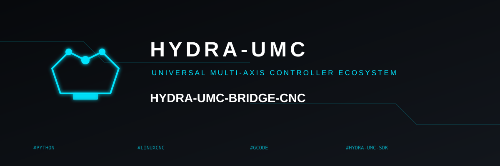

<!-- =============================================================================
HYDRA-UMC-BRIDGE-CNC - CNC 单元协调桥接
Copyright (C) 2026 JuanenRac (Electro Hobby 3D) <electrohobby3d@gmail.com>
GPL-3.0-or-later - see LICENSE
============================================================================= -->

<p align="center">
  
</p>

# 🔧 HYDRA-UMC-BRIDGE-CNC

<p align="center"><a href="README.md">🇺🇸 English</a> | <a href="README_spa.md">🇪🇸 Español</a> | <a href="README_fra.md">🇫🇷 Français</a> | <a href="README_ita.md">🇮🇹 Italiano</a> | <a href="README_deu.md">🇩🇪 Deutsch</a> | 🇨🇳 <b>简体中文</b> | <a href="README_jpn.md">🇯🇵 日本語</a></p>

### 🛑 面向 CNC 单元的故障安全协调桥接

<p align="left">
  
  
  
</p>

---

## 1. 🛠️ 技术概览

**HYDRA-UMC-BRIDGE-CNC** 是 CNC 单元与 HYDRA-UMC 机器人辅助设备之间的高层桥接:上料、下料、工件搬运以及受监督的辅助任务。它绝不会成为实时轨迹控制器 —— CNC 控制器(LinuxCNC 或其他)始终保留对轨迹、主轴和机床限位的控制权。

它属于 **External Automation Bridges** 家族:一组共享 `HYDRA-UMC-SDK` 相同安全契约的兄弟仓库(CNC、LASER、OPENPNP、PRINTER3D、ROS2),因此任何一个桥接都不能自行发明"可以安全工作"的定义。

### 核心特性:
* ✅ **真实的故障安全单元快照:** `cell.py` 中的 `CncSnapshot.machine_state()` 会先检查急停(E-STOP)和门状态,*然后*才查看控制器上报的任何内容 —— 只要急停被触发或门未关闭,状态始终解析为 `SAFE_STOP`,与 `controller_state` 报告的内容无关。*(已实现,并在 `tests/test_cell.py` 中测试)*
* ✅ **真实的共享安全门控:** 每个被观察到的任务都会通过 `HYDRA-UMC-SDK` 的 `bridge_contract` 中的 `evaluate_job()` 重新评估,这与所有兄弟桥接以及 HYDRA-UMC-SERVER 使用的是同一个门控。*(已实现)*
* ✅ **保守的状态映射:** 只有 `IDLE` 被视为空闲;`RUN`/`RUNNING`/`HOLD` 映射为 `RUNNING`,`FAULT`/`ERROR`/`OFF` 映射为 `FAULT`,任何无法识别的值都会回落到 `OFFLINE`——绝不会回落到允许生产性工作的状态。*(已实现)*
* ✅ **只读控制器证据:** `observation.py` 严格规范化本地映射证据和提供的 GRBL 状态行;缺失或非布尔的 E-STOP/门信号会安全失效关闭。*(已实现,在 `tests/test_observation.py` 中测试)*
* ✅ **真实的 GRBL 串行传输:** `serial_transport.py` 的 `GrblSerialProbe` 打开真实的串行连接并查询 GRBL 的实时状态字节(`?`);`GrblRealtimeControl` 只发送 GRBL 自身的实时控制字节(进给保持、循环恢复、软复位)——`cycle_start_resume()` 仅在机器真正处于 `HOLDING` 状态时才被允许,其他命令则始终允许,如 `ABORT`。它从不流式传输 G-code 程序。*(已实现,在 `tests/test_serial_transport.py` 中测试)*
* ✅ **非变更式构建/测试:** `build-test.bat`/`.sh` 编译源码并运行安全门控测试套件,不会触碰版本文件或 CHANGELOG。*(已实现,见下方"构建与运行")*
* 🔜 **LinuxCNC HAL 适配器** —— 尚未实现;目前还没有驱动过真实的 CNC 控制器、HAL 引脚或机器人。*(计划中)*

---

## 2. 🔄 单元协调流程


---

## 3. 🧱 架构与设计决策

* **为什么先检查急停和门状态,而不是先看控制器自身上报的状态。** `CncSnapshot.machine_state()` 会在检测到 `estop` 或门未关闭时,第一时间短路为 `SAFE_STOP` —— 一个门开着却仍上报 `IDLE` 的控制器,绝不能被照单全收。
* **为什么控制器状态的映射被刻意设计得保守。** 只有字面字符串 `IDLE` 会被映射为 `MachineState.IDLE`。任何无法识别的值都会回落到 `OFFLINE`,绝不会回落到允许辅助工作的状态 —— 未知的控制器状态被当作"不知道"处理,而不是"大概没问题"。
* **为什么桥接会构造一个新的 `BridgeJob` 并委托给共享的 `evaluate_job()`,而不是自己编写接受/拒绝逻辑。** 全部五个 External Automation Bridges(CNC、LASER、OPENPNP、PRINTER3D、ROS2)都复用 `HYDRA-UMC-SDK` 中完全相同的 `bridge_contract`,因此"什么才算安全到可以启动任务"不会在它们之间悄悄产生分歧。
* **为什么 LinuxCNC HAL 适配器尚未加入本仓库。** 接线真实的 HAL 引脚是一个必须针对真实控制器验证的软硬件集成步骤;在完成验证之前就在此声称已实现,将是这个本地核心无法兑现的承诺。
* **它如何融入整个生态系统。** BRIDGE-CNC 位于 CNC 控制器与 `HYDRA-UMC-SDK` → `HYDRA-UMC-SERVER` → MCU/单元安全之间:它协调围绕 CNC 的辅助机器人工作,而不会取代或凌驾于控制器自身的安全权限之上。

---

## 📂 目录结构

```text
HYDRA-UMC-BRIDGE-CNC/
├── src/
│   └── hydra_umc_bridge_cnc/
│       ├── __init__.py
│       ├── cell.py              # CncSnapshot + CncCellBridge 安全门控
│       ├── observation.py       # 只读映射与 GRBL 状态归一化
│       ├── serial_transport.py  # 真实的 fail-closed GRBL 串口传输 - 仅状态查询和实时控制字节
│       └── mqtt_transport.py    # 面向此 bridge 已有真实逻辑的真实 MQTT broker 传输
├── tests/
│   ├── test_cell.py             # 安全空闲准入、开门拒绝、中止转发
│   ├── test_observation.py      # 缺失安全证据时 fail-closed 失败
│   ├── test_serial_transport.py # 针对模拟串口的真实传输测试,含 fail-closed 路径
│   └── test_mqtt_transport.py   # 针对模拟 broker 客户端的 MQTT 命令/状态格式测试
├── tools/
│   ├── build_test.py            # 非变更式编译 + 测试运行器 (build-test.bat/.sh)
│   └── bump_version.py          # 同步 pyproject.toml、清单和 CHANGELOG.md
├── docs/
│   ├── BRIDGE_GUIDE.md                    # 范围、兼容平台、脚本、硬件验收门控
│   └── CONTROLLER_EVIDENCE_BOUNDARY.md    # 什么算作真实安全证据,以及此 bridge 拒绝推断的内容
├── images/
│   └── HYDRA_UMC_BANNER.svg     # README 横幅图
├── build-test.bat / build-test.sh  # 仅验证,绝不修改仓库
├── build.bat / build.sh            # 先验证,成功后才更新版本 + CHANGELOG
├── pyproject.toml               # 包元数据;依赖 HYDRA-UMC-SDK (git)
├── hydra-umc.project.json       # 生态系统清单(版本、成熟度、家族)
├── CHANGELOG.md
├── CODE_OF_CONDUCT.md / CONTRIBUTING.md / SECURITY.md / SUPPORT.md
├── LICENSE / LICENSE.md
└── README.md / README_*.md      # 本文件及其 6 种译文
```

---

## 4. ⚙️ 构建与运行

需要 Python 3.11+。`tools/build_test.py` 期望 `HYDRA-UMC-SDK` 作为兄弟目录被检出(`../HYDRA-UMC-SDK`),或通过环境变量 `HYDRA_UMC_SDK_ROOT` 指定。

```bash
# Windows
build-test.bat      # 仅验证 —— 不改变版本/CHANGELOG
build.bat            # 先验证,成功后更新版本 + CHANGELOG

# Linux/macOS
bash build-test.sh
bash build.sh
```

`build-test` 使用 `py_compile` 编译 `src/` 下的每个模块,并运行完整的 `unittest` 套件(`tests/test_cell.py`),证明安全空闲准入、开门拒绝和中止转发均按预期工作 —— 它绝不会修改仓库。`build` 会先运行同样的验证,只有成功后才调用 `tools/bump_version.py`,在 `pyproject.toml`、`hydra-umc.project.json` 和 `CHANGELOG.md` 之间同步版本号。目前尚无真正的 CNC `run` 命令 —— 这需要经过验证的控制器集成。

---

## ✅ 当前状态与后续步骤

**目前真实的部分:** 版本 `0.0.7`,一个已在本地测试过的故障安全单元协调器(`CncSnapshot` + `CncCellBridge`),依托 `HYDRA-UMC-SDK` 的共享任务门控,包含严格的只读控制器证据标准化,覆盖 GRBL v1.1 完整的真实状态词汇表,包括真实的 `Hold:N`/`Door:N` 子状态(`Idle`/`Run`/`Jog`/`Home`/`Hold`/`Alarm`/`Door`)以及 MTConnect 执行状态,一个真实的串行传输层(`GrblSerialProbe`/`GrblRealtimeControl`),可通过真实连接查询状态并发送 GRBL 自身的实时控制字节,配有确定性的四十二项 `unittest` 测试套件,以及已接入 CI 并带 SDK 检出的非变更式 build-test 脚本。

**集成边界:** CNC 控制器(LinuxCNC 或其他)始终保留对轨迹、主轴和机床限位的控制权;本桥接只负责门控*辅助*机器人工作,绝不涉及控制器自身的运动。

**仍待完成:** 目前还没有驱动过真实的 CNC 控制器、LinuxCNC HAL 引脚或机器人 —— 选择并验证具体的 HAL 适配器,是一个只有在拿到机器及其文档化接口之后才会进行的软硬件集成步骤。

---

## 🔗 相关项目

本项目是同一作者(JuanenRac / Electro Hobby 3D)打造的 HYDRA-UMC 机器人生态系统的一部分。值得了解,因为某个请求实际上可能是关于这些项目之一,而非本仓库本身。

**父项目**
- **[HYDRA-UMC-SERVER](https://github.com/JuanenRac/HYDRA-UMC-SERVER)** — 每个控制客户端真正通信的真实无头后端(REST/WebSocket);每条指令通过本桥接自身的本地安全门限后,本桥接向其汇报的经过认证的生态系统边界。

**兄弟项目** —— 同样与 HYDRA-UMC-SERVER 自身 API 通信,各自作为独立客户端
- **[HYDRA-UMC-STUDIO](https://github.com/JuanenRac/HYDRA-UMC-STUDIO)** — 具有实时多机器人 3D 可视化的网页控制面板。
- **[HYDRA-UMC-SUITE](https://github.com/JuanenRac/HYDRA-UMC-SUITE)** — 面向多台服务器的桌面(PySide6)集群指挥中心，打包为独立可执行文件。
- **[HYDRA-UMC-ANDROID-CONTROL](https://github.com/JuanenRac/HYDRA-UMC-ANDROID-CONTROL)** — 具有生物识别登录和配对 Wear OS 伴侣应用的原生 Android 控制应用。
- **[HYDRA-UMC-IOS-CONTROL](https://github.com/JuanenRac/HYDRA-UMC-IOS-CONTROL)** — 具有实时 WebSocket 同步的 iOS/iPadOS 控制应用(Flutter)。
- **[HYDRA-UMC-DSI](https://github.com/JuanenRac/HYDRA-UMC-DSI)** — 面向机载 7 英寸 DSI 触摸屏的原生触控界面，直接嵌入 CM5 本体。
- **[HYDRA-UMC-BRIDGE-AMR](https://github.com/JuanenRac/HYDRA-UMC-BRIDGE-AMR)** — 通过真实的 VDA 5050 MQTT 发布者为 AGV/AMR 车队提供的协调边界。
- **[HYDRA-UMC-BRIDGE-DROIDS](https://github.com/JuanenRac/HYDRA-UMC-BRIDGE-DROIDS)** — 面向足式/人形机器人的协调边界，具备真实的 Boston Dynamics Spot 指令发送器。
- **[HYDRA-UMC-BRIDGE-LASER](https://github.com/JuanenRac/HYDRA-UMC-BRIDGE-LASER)** — 读取 3 项真实钥匙/外壳/联锁 GPIO 安全信号的激光单元安全协调器。
- **[HYDRA-UMC-BRIDGE-OPENPNP](https://github.com/JuanenRac/HYDRA-UMC-BRIDGE-OPENPNP)** — 面向 OpenPnP 贴片机板级流程的安全高层协调器。
- **[HYDRA-UMC-BRIDGE-PRINTER3D](https://github.com/JuanenRac/HYDRA-UMC-BRIDGE-PRINTER3D)** — 面向 Moonraker/Klipper 3D 打印机的安全协调边界，具备真实的受控作业指令。
- **[HYDRA-UMC-BRIDGE-ROS2](https://github.com/JuanenRac/HYDRA-UMC-BRIDGE-ROS2)** — 具备真实的惰性导入 rclpy ROS 2 传输层的安全协调器。
- **[HYDRA-UMC-BRIDGE-UAV](https://github.com/JuanenRac/HYDRA-UMC-BRIDGE-UAV)** — 面向搭载摄像头的无人机的协调边界，具备真实的 MAVLink 指令发送器。

**直接相关**
- **[HYDRA-UMC-SDK](https://github.com/JuanenRac/HYDRA-UMC-SDK)** — 每个桥接都据此校验自身指令的共享 JSON-Schema 契约与安全门限边界。
- **[HYDRA-UMC-MQTT-BROKER](https://github.com/JuanenRac/HYDRA-UMC-MQTT-BROKER)** — `mqtt_transport.py` 为本桥接自身 `hydra/bridges/cnc/...` 主题提供的真实传输——状态加上 jog/reset/resume 控制字节,以及共享的作业门限;详见该仓库自身的 `docs/BRIDGE_TOPICS.md`。
- **[HYDRA-UMC-HIL-BRIDGE](https://github.com/JuanenRac/HYDRA-UMC-HIL-BRIDGE)** — 面向真实控制器集成的未来硬件在环验证路径。

**生态系统中的其他项目**

*核心硬件与平台*
- **[HYDRA-UMC](https://github.com/JuanenRac/HYDRA-UMC)** — 机器人手臂的真实主板——CM5 主机 + 双核 STM32H745，通过 CAN-OTA/SPI-OTA 协调最多 8 条工具臂。
- **[HYDRA-UMC-OS](https://github.com/JuanenRac/HYDRA-UMC-OS)** — 面向 CM5 的可复现 Raspberry Pi OS 产品层——只读代理、经过验证的配置/配置文件、WiFi 首次配网。

*核心后端与客户端*
- **[HYDRA-UMC-EDITOR-URDF](https://github.com/JuanenRac/HYDRA-UMC-EDITOR-URDF)** — 将完成的模型推送到 STUDIO 自身目录的桌面版图形化 URDF 创建/编辑工具。

*URTC 工具平台*
- **[URTC](https://github.com/JuanenRac/URTC)** — 面向实体 Universal Robot Tool Controller 板卡的固件，通过 CAN 总线支持 25 种以上工具配置。
- **[URTC-FLASHER](https://github.com/JuanenRac/URTC-FLASHER)** — 面向 URTC 板卡的桌面图形烧录工具，支持 CAN-OTA 以及全芯片 SWD/JTAG。
- **[URTC-TESTER](https://github.com/JuanenRac/URTC-TESTER)** — 面向 URTC 板卡的桌面实时 CAN 总线诊断工具，每种工具配置对应一个面板。
- **[URTC-WEB-STUDIO](https://github.com/JuanenRac/URTC-WEB-STUDIO)** — 通过 Web Serial API 实现的浏览器版 URTC-TESTER 替代方案，无需本地安装。

*视觉 AI 节点(Hailo-8)*
- **[HYDRA-UMC-VISION-NODE](https://github.com/JuanenRac/HYDRA-UMC-VISION-NODE)** — 面向 Hailo-8 视觉流水线的集成中枢，具备逐阶段的真实硬件就绪检测。
- **[HYDRA-UMC-DETECTION-HEF](https://github.com/JuanenRac/HYDRA-UMC-DETECTION-HEF)** — 具备 Hailo 架构/校验和安全加载验证的真实编译模型注册表。
- **[HYDRA-UMC-VISION-STREAMER](https://github.com/JuanenRac/HYDRA-UMC-VISION-STREAMER)** — 具备真实 HailoRT 集成边界的真实 GStreamer 流水线 + MediaMTX 配置生成器。
- **[HYDRA-UMC-VISUAL-SERVOING-API](https://github.com/JuanenRac/HYDRA-UMC-VISUAL-SERVOING-API)** — 具备真实 Position-Based Visual Servoing 修正律，并依据上游区域状态进行安全门控。
- **[HYDRA-UMC-SAFETY-ZONES](https://github.com/JuanenRac/HYDRA-UMC-SAFETY-ZONES)** — 具备校准新鲜度强制检查的真实区域入侵检测与 E-STOP 请求。

*认知 AI 节点(Hailo-10)*
- **[HYDRA-UMC-COGNITIVE-NODE](https://github.com/JuanenRac/HYDRA-UMC-COGNITIVE-NODE)** — 面向 Hailo-10 认知流水线(LLM/VLA/语音编排)的集成中枢。
- **[HYDRA-UMC-VLA-ENGINE](https://github.com/JuanenRac/HYDRA-UMC-VLA-ENGINE)** — 面向 Vision-Language-Action 模型的真实动作 token 编解码与轨迹生成。
- **[HYDRA-UMC-VOICE-UI](https://github.com/JuanenRac/HYDRA-UMC-VOICE-UI)** — 具备受限、需确认的 Watch 中继的真实语音前端(VAD + 意图解析)。
- **[HYDRA-UMC-SEMANTIC-PLANNER](https://github.com/JuanenRac/HYDRA-UMC-SEMANTIC-PLANNER)** — 基于真实规则的任务分解，以及针对 MCU 错误码的语义化错误恢复。
- **[HYDRA-UMC-DOCS-QA](https://github.com/JuanenRac/HYDRA-UMC-DOCS-QA)** — 面向本生态系统自身 Markdown 文档的真实纯标准库 TF-IDF 文档检索。

*编排与集群*
- **[HYDRA-UMC-ORCHESTRATOR](https://github.com/JuanenRac/HYDRA-UMC-ORCHESTRATOR)** — 具备真实 gRPC/Protobuf 健康报告契约与任务状态机的集成中枢。
- **[HYDRA-UMC-JOB-DISPATCHER](https://github.com/JuanenRac/HYDRA-UMC-JOB-DISPATCHER)** — 基于真实 HTTP API 的真实优先级任务队列，支持去重。
- **[HYDRA-UMC-NODE-HEALING](https://github.com/JuanenRac/HYDRA-UMC-NODE-HEALING)** — 具备重试/退避与身份不匹配检测的真实基于 gRPC 的车队健康看门狗。
- **[HYDRA-UMC-PATH-PLANNER-3D](https://github.com/JuanenRac/HYDRA-UMC-PATH-PLANNER-3D)** — 具备真实障碍物/工作空间碰撞校验的真实基于 RRT 的三维路径规划器。
- **[HYDRA-UMC-SWARM-SYNC](https://github.com/JuanenRac/HYDRA-UMC-SWARM-SYNC)** — 经过多单元收敛属性测试的真实 CRDT LWW-Element-Map 状态同步。

*数字孪生与仿真*
- **[HYDRA-UMC-TWIN](https://github.com/JuanenRac/HYDRA-UMC-TWIN)** — 面向数字孪生引擎的集成中枢，具备真实的版本兼容性同步契约。
- **[HYDRA-UMC-PHYSICS-REPLICA](https://github.com/JuanenRac/HYDRA-UMC-PHYSICS-REPLICA)** — 面向真实 URDF 子集的真实正向运动学与关节限位校验。
- **[HYDRA-UMC-SYNTHETIC-DATA-GEN](https://github.com/JuanenRac/HYDRA-UMC-SYNTHETIC-DATA-GEN)** — 具备 YOLO/COCO 标注导出功能的真实程序化 2D 场景生成器。

*数据与分析*
- **[HYDRA-UMC-DATALAKE](https://github.com/JuanenRac/HYDRA-UMC-DATALAKE)** — 具备真实数据摄入/查询 HTTP API 的真实 sqlite3 时序数据存储。
- **[HYDRA-UMC-ANOMALY-DETECTOR](https://github.com/JuanenRac/HYDRA-UMC-ANOMALY-DETECTOR)** — 具备漂移监测能力的真实 FFT + 统计基线异常检测器。
- **[HYDRA-UMC-PRODUCTION-REPORTS](https://github.com/JuanenRac/HYDRA-UMC-PRODUCTION-REPORTS)** — 基于 DATALAKE 历史数据的真实 OEE/可用率计算，支持可复现的 CSV 导出。
- **[HYDRA-UMC-TELEMETRY-COLLECTOR](https://github.com/JuanenRac/HYDRA-UMC-TELEMETRY-COLLECTOR)** — 面向 DATALAKE 的真实 CAN/WebSocket 数据摄入管道，支持序列去重。

*工业网关*
- **[HYDRA-UMC-GATEWAY-INDUSTRIAL](https://github.com/JuanenRac/HYDRA-UMC-GATEWAY-INDUSTRIAL)** — 中继至工业协议的集成中枢，具备真实的指令白名单/背压控制层。
- **[HYDRA-UMC-OPCUA-SERVER](https://github.com/JuanenRac/HYDRA-UMC-OPCUA-SERVER)** — 经真实二进制协议客户端会话验证的真实 OPC-UA 地址空间。
- **[HYDRA-UMC-MTCONNECT-ADAPTER](https://github.com/JuanenRac/HYDRA-UMC-MTCONNECT-ADAPTER)** — 具备降级模式输出的真实 MTConnect `/probe` 与 `/current` XML 端点。

*辅助工具与生态系统运维*
- **[HYDRA-UMC-DASHBOARD-AI](https://github.com/JuanenRac/HYDRA-UMC-DASHBOARD-AI)** — 基于 DATALAKE/ANOMALY-DETECTOR 的智能摘要与异常高亮面板，具备诚实的统计回退机制。
- **[HYDRA-UMC-TOOL-CLI](https://github.com/JuanenRac/HYDRA-UMC-TOOL-CLI)** — 具备真实、稳定退出码契约的车队 CLI，是 HYDRA-UMC-SERVER 自身 API 的真实在线客户端。
- **[HYDRA-UMC-WATCH](https://github.com/JuanenRac/HYDRA-UMC-WATCH)** — 具备真实触觉提醒与配对手机语音中继功能的 WearOS 伴侣应用。
- **[URTC-SMART-RACK](https://github.com/JuanenRac/URTC-SMART-RACK)** — 面向板卡安装机架的固件，具备真实的工具 ID 解码与 Smart Idle 预热逻辑。
- **[URTC-VISION-TOOL](https://github.com/JuanenRac/URTC-VISION-TOOL)** — 面向热成像/RGB 检测工具头的固件及真实 Python 视觉伴侣程序。
- **[HYDRA-UMC-UPDATER](https://github.com/JuanenRac/HYDRA-UMC-UPDATER)** — 发现、克隆并更新本生态系统中每个仓库的管理类桌面工具。

---

## 📚 文档与社区

- **[CONTRIBUTING.md](CONTRIBUTING.md)** —— 提交 Pull Request 所需的技术栈和编码规范。
- **[CODE_OF_CONDUCT.md](CODE_OF_CONDUCT.md)** —— 本社区所期望的行为准则。
- **[SECURITY.md](SECURITY.md)** —— 如何报告漏洞，以及本项目真实的安全关注重点。
- **[SUPPORT.md](SUPPORT.md)** —— 在哪里提问和报告缺陷。
- **[LICENSE.md](LICENSE.md)** —— 本项目自身的许可证。

## 👤 作者
**JuanenRac** (Electro Hobby 3D)
📧 electrohobby3d@gmail.com
📺 [youtube.com/@electrohobby3d](https://youtube.com/@electrohobby3d)

## 📜 许可证
GPL-3.0 - 详见 LICENSE。
